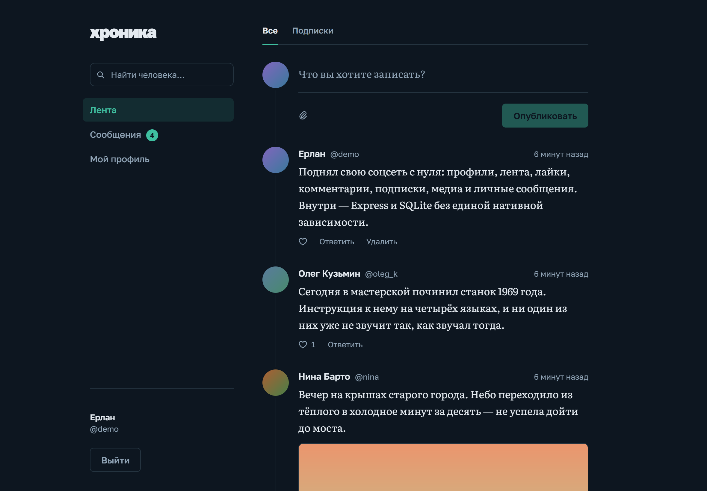
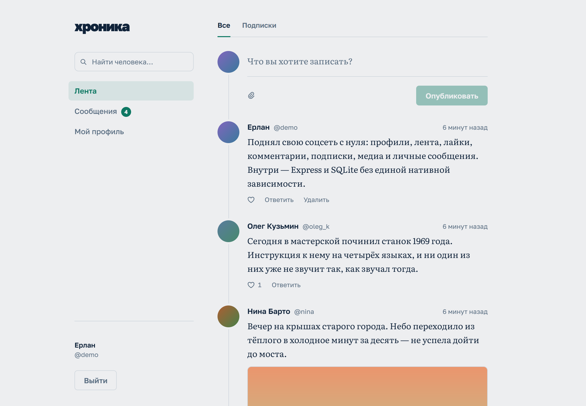
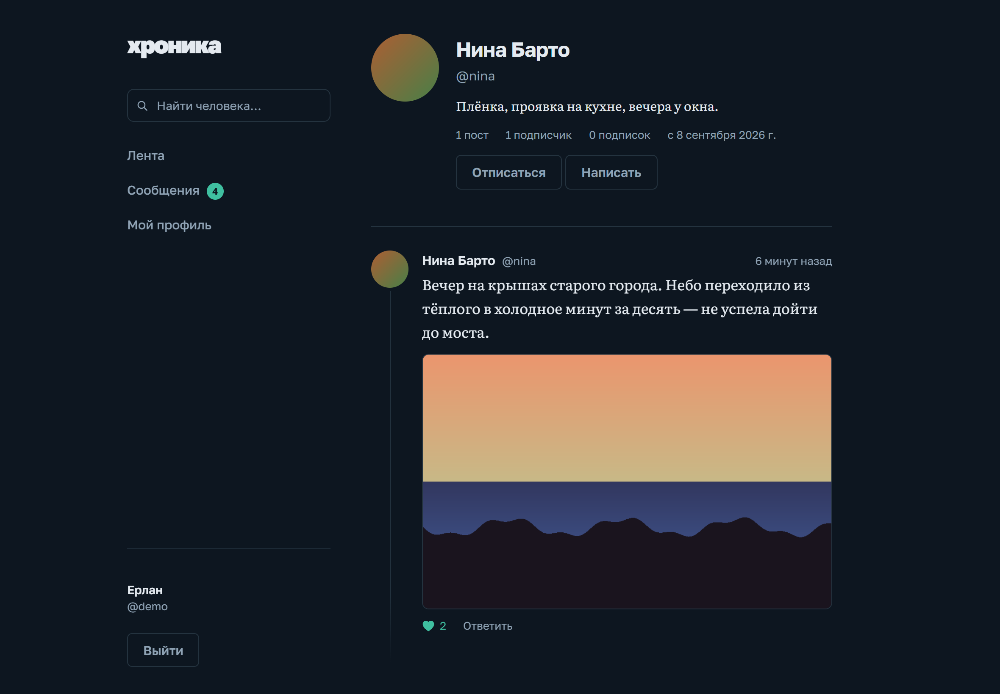
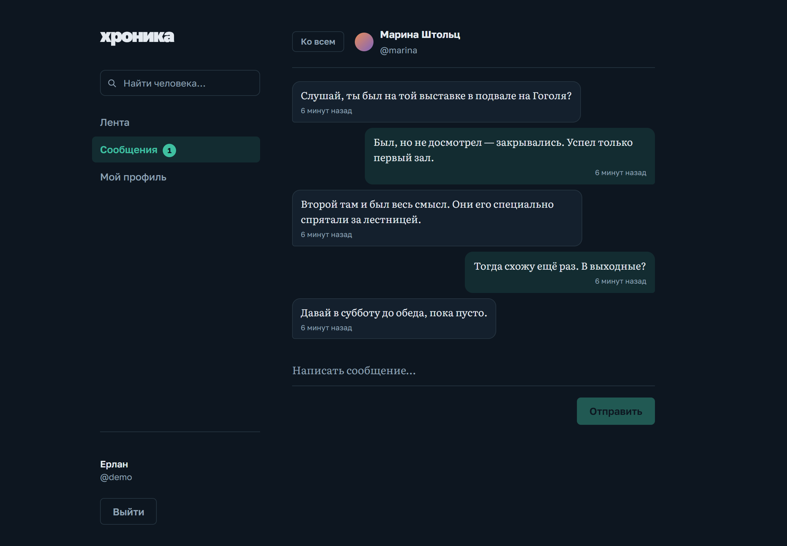

# Хроника

Социальная сеть: регистрация с восстановлением пароля, профили с аватарами,
лента, посты с фотографиями, видео и музыкой, лайки, комментарии, подписки,
поиск людей и мессенджер в духе Телеграма — личные сообщения, групповые чаты и
каналы, со статусом «в сети», галочками прочтения, реакциями, ответами, фото,
файлами и голосовыми. Есть лента событий с общим
счётчиком непрочитанного, блокировка собеседника и жалоба на запись, ответ
или человека.

Своя хроника читается не только сверху вниз: полнотекстовый поиск по текстам
записей, архив профиля по месяцам и личные закладки — три экрана, которые
превращают ленту в то, по чему можно ходить.

Вёрстка построена вокруг чтения, а не вокруг медиа: одна колонка на «хребте»
времени, засечный шрифт в телах постов, изображения вписываются целиком, а не
обрезаются до квадрата.

**Витрина: https://erlan4761.github.io/Social-site/**

Интерфейс там живой — можно писать посты, ставить отметки, отвечать, листать
переписку. Но бэкенда за ним нет: GitHub Pages раздаёт только статику, поэтому
витрина ходит в подставной API прямо в браузере, а данные сбрасываются при
перезагрузке. Настоящая версия с Express, SQLite и загрузкой файлов
поднимается локально — см. «Запуск».

<p align="center">
  
  
</p>
<p align="center">
  
  
</p>

## Инженерные решения

Восемь вещей в проекте, за которыми стоит не «сделал по гайду», а конкретная
причина — где смотреть код и почему так, а не иначе.

- **Тип файла определяется по сигнатуре байтов, а не по заявленному
  MIME или расширению.** Переименованный `.html` под видом картинки — это
  классический путь для хранимой XSS; он отсекается до того, как файл вообще
  попадёт на диск. → [`media.js:18`](server/src/media.js#L18)

- **Поиск людей — это JS, а не SQL `LIKE`.** Первая версия была на `LIKE` и
  падала на собственном тесте: у SQLite регистронезависимое сравнение
  работает только для ASCII, «Борис» не совпадал с «борис». Нашлось не при
  ревью, а из-за упавшего теста. → [`users.js:74`](server/src/routes/users.js#L74)

- **Поиск по записям — FTS5, и это другой поиск, а не тот же самый.** Профиль
  заводят один раз, а пишут каждый день — записей всегда кратно больше, и
  приём «прочитать таблицу в память» упёрся бы в потолок здесь первым. Индекс `posts_fts` ведут три триггера, а не код
  роутов; `ё` сворачивается в `е` с обеих сторон — и в индексе, и в запросе, —
  потому что кириллическое `ё` токенизатор `unicode61` не трогает ни при каком
  `remove_diacritics`. → [`db.js:211`](server/src/db.js#L211),
  [`search.js`](server/src/search.js)

- **Лента постранична по `id`, а не по номеру страницы.** Курсор — это id
  последнего показанного поста, поэтому появление новых записей сверху не
  сдвигает то, что человек уже пролистал. → [`posts.js:111`](server/src/routes/posts.js#L111)

- **База и код разведены по разным путям.** `DATA_DIR` указывает на
  постоянный диск хостинга, а не на папку с кодом — код перезаписывается при
  каждом деплое, диск переживает их все. → [`dataDir.js`](server/src/dataDir.js)

- **Открытые личные сообщения намеренно, но не без страховки.** Писать может
  кто угодно кому угодно, как в открытых ЛС — и отправка ограничена частотой
  в минуту, иначе это был бы готовый канал для рассылки.

- **Блокировка — один SQL-фрагмент, а не десять проверок в роутах.** Правило
  «не видим друг друга и не пишем друг другу» применяется в десяти местах:
  лента, запись, ветка ответов, поиск, профиль, ЛС, чаты. Десять частных
  проверок разошлись бы через месяц; один фрагмент, подставляемый в запрос,
  можно проверить целиком. → [`blocks.js:42`](server/src/blocks.js#L42)

- **Уведомление создаётся в одном месте и умеет молчать.** `notify()` сама не
  уведомляет о своих действиях, молчит внутри заблокированной пары, не плодит
  дубли на повторный лайк и схлопывает сообщения — по одному непрочитанному
  событию на диалог. Роутам про эти правила знать не нужно.
  → [`notifications.js:49`](server/src/notifications.js#L49)

## Стек

| Слой      | Что                                                        |
| --------- | ---------------------------------------------------------- |
| Фронтенд  | React 19 + TypeScript + Vite, React Router                 |
| Бэкенд    | Node.js + Express 5                                        |
| БД        | SQLite через встроенный `node:sqlite` — файл, без установки |
| Авторизация | `crypto.scrypt` + отзываемые сессии в httpOnly-куке       |

Нативных зависимостей нет: `npm install` не собирает C++ и не требует Visual Studio.

**Требуется Node.js 22.5 или новее** (в нём появился модуль `node:sqlite`). Рекомендуется LTS:

```
winget install OpenJS.NodeJS.LTS
```

## Запуск

Два терминала.

```
cd server
npm install
npm run dev
```

```
cd web
npm install
npm run dev
```

Открыть http://localhost:5173. Vite проксирует `/api` на бэкенд (порт 3001), поэтому
фронт и API живут на одном origin и кука сессии работает без CORS.

База создаётся сама при первом запуске: `server/data/app.db` (в git не попадает).

## Сборка

```
cd web && npm run build
cd ../server && npm start
```

Собранный фронтенд сервер отдаёт сам с того же порта — открыть http://localhost:3001.

## Развёртывание

В корне лежит `render.yaml` — описание боевого сервиса: сборка, постоянный
диск на 1 ГБ и переменные окружения. Render читает его сам, руками в веб-форме
настраивать нечего.

Тариф именно **Starter**, а не бесплатный: на бесплатном диск не подключается,
файловая система обнуляется при каждом перезапуске, а перезапуск случается сам
после 15 минут простоя — аккаунты и переписка пропадали бы.

| Переменная  | Зачем                                                        |
| ----------- | ------------------------------------------------------------ |
| `DATA_DIR`  | Куда класть базу и загрузки. На хостинге — точка монтирования диска: код перезаписывается при деплое, диск переживает их все |
| `NODE_ENV`  | `production` переключает куку сессии в `secure` — по HTTP она больше не уйдёт |
| `NODE_VERSION` | 24 — на нём проект и проверялся                            |
| `RESEND_API_KEY` | Секрет, в репозитории его нет — Render спросит значение при создании сервиса. Пустое — письма сброса пароля пишутся в лог сервиса |

Фронтенд собирается через `npm ci --include=dev`, и это не опечатка:
`NODE_ENV=production` действует и во время сборки, а в этом режиме `npm ci`
пропускает devDependencies — вместе с `typescript` и `vite`.

### Бесплатно: с этого компьютера через туннель

Без хостинга вообще: сервер работает у вас, а бесплатный туннель Cloudflare
даёт ему публичный HTTPS-адрес вида `https://что-то.trycloudflare.com`.
Сайт доступен, пока открыто окно скрипта; адрес новый при каждом запуске.
Нужен [cloudflared](https://github.com/cloudflare/cloudflared/releases) —
скрипт ищет его в `%USERPROFILE%\tools\cloudflared.exe` или в `PATH`.

```powershell
powershell -ExecutionPolicy Bypass -File scripts\share.ps1
```

Скрипт собирает фронтенд, поднимает туннель, запускает сервер в боевом
режиме и печатает адрес. Данные живут отдельно от разработки — в
`%USERPROFILE%\hronika-data`. Письма сброса пароля печатаются в это же окно
со ссылкой на адрес туннеля. Проверено: за туннелем сервер видит настоящий IP
посетителя (лимиты на вход считаются по людям, а не одним на всех), подделка
`X-Forwarded-For` не проходит, кука сессии уходит только по HTTPS.

`RELAX_RATE_LIMITS` в бою задавать нельзя: она снимает защиту от перебора
паролей и рассылки в личных сообщениях.

## API

Все ответы — JSON. Сессия передаётся кукой `sid` (httpOnly, SameSite=Lax).

| Метод    | Путь                  | Что делает                                     |
| -------- | --------------------- | ---------------------------------------------- |
| `POST`   | `/api/auth/phone/start` | Номер → SMS с кодом (вход и регистрация одним путём) |
| `POST`   | `/api/auth/phone/verify` | Код → `signed-in`, `password` (+билет) или `signup` (+билет) |
| `POST`   | `/api/auth/phone/password` | Двухэтапная проверка: пароль по билету → вход |
| `POST`   | `/api/auth/phone/signup` | Новый номер: логин и имя по билету → аккаунт и вход |
| `POST`   | `/api/auth/register`  | Закрыто: `410`, регистрация — только по номеру  |
| `POST`   | `/api/auth/login`     | Вход по логину и паролю — только старые аккаунты |
| `POST`   | `/api/account/phone/start` | Код на номер, чтобы привязать или сменить его |
| `PUT`    | `/api/account/phone`  | Подтвердить номер кодом; `DELETE` — отвязать (только старым) |
| `POST`   | `/api/account/delete-code` | Код для удаления аккаунта без пароля        |
| `POST`   | `/api/auth/logout`    | Выход, удаляет сессию из БД                     |
| `GET`    | `/api/auth/me`        | Текущий пользователь или `null`                 |
| `GET`    | `/api/events`         | Живой поток (SSE): толчки «перечитай переписку / чат / канал / счётчики» |
| `GET`    | `/api/push/key`       | Открытый ключ VAPID для подписки браузера        |
| `PUT`    | `/api/push/subscription` | Подписать это устройство на пуш-уведомления; `DELETE` — отписать |
| `POST`   | `/api/auth/forgot-password` | Запросить ссылку для сброса пароля        |
| `GET`    | `/api/auth/reset-password/:token` | Проверить ссылку, не тратя её        |
| `POST`   | `/api/auth/reset-password` | Задать новый пароль по токену              |
| `GET`    | `/api/account`        | Почта, «кто видит время захода», дата регистрации |
| `POST`   | `/api/auth/qr` | Компьютер: новый запрос входа по QR — `token`, `code`, `secret` |
| `POST`   | `/api/auth/qr/poll` | Компьютер ждёт подтверждения: `{ token, secret }` → `pending` или сеанс |
| `GET`    | `/api/auth/qr/:token-или-код` | Телефон: какое устройство просит войти |
| `POST`   | `/api/auth/qr/approve` | Телефон подтверждает вход: `{ token }` или `{ code }` |
| `PUT`    | `/api/account/username` | Сменить логин; старый 14 дней закреплён за вами |
| `GET`    | `/api/account/export` | Все свои данные одним JSON-файлом (`Content-Disposition: attachment`); пять выгрузок в час |
| `PUT`    | `/api/account/privacy` | Приватность: `lastSeen`, `phoneFind`, `phoneShow` — каждая `all`, `follows` или `nobody`; меняется только присланное |
| `PUT`    | `/api/account/password` | Сменить пароль по текущему; другие сеансы закрываются |
| `GET`    | `/api/account/sessions` | Где выполнен вход: устройство, дата входа и когда пользовались (`lastUsedAt`), без токенов |
| `PUT`    | `/api/account/session-ttl` | Через сколько дней без использования сеанс закрывается сам: `{ days }` — 7, 30, 90, 180 или 365 → `{ days, ended }` |
| `DELETE` | `/api/account/sessions/:id` | Завершить сеанс; без `:id` — все, кроме текущего |
| `DELETE` | `/api/account`        | Удалить аккаунт — с паролем, навсегда            |
| `POST`   | `/api/account/2fa/setup` | Вход с кодом: секрет и адрес `otpauth://` для QR (пароль — если он есть) |
| `POST`   | `/api/account/2fa/enable` | Первый код из приложения включает проверку → десять резервных кодов, один раз |
| `POST`   | `/api/account/2fa/backup-codes` | Новые резервные коды по коду; прежние гаснут |
| `POST`   | `/api/account/2fa/disable` | Отключить — паролем (если есть) и кодом |
| `POST`   | `/api/auth/2fa`       | Второй шаг входа: `{ ticket, code }` — код из приложения или резервный |
| `GET`    | `/api/users/search`   | Поиск людей по `?q=` — логин и отображаемое имя |
| `POST`   | `/api/users/by-phone` | Люди по номерам `{ phones }` (до 50) — только номер целиком и только разрешившие |
| `GET`    | `/api/search/posts`   | Поиск по текстам записей: `?q=`, `?author=`, `?cursor=` |
| `GET`    | `/api/users/:username`| Профиль и число постов                          |
| `GET`    | `/api/users/:username/archive` | Месяцы, в которых у автора есть видимые записи |
| `PATCH`  | `/api/users/me`       | Изменить имя и «о себе»                         |
| `GET`    | `/api/posts`          | Лента; `?author=`, `?period=` и `?cursor=` — фильтры и пагинация |
| `GET`    | `/api/posts/:id`      | Одна запись — для страницы `/p/:id`             |
| `POST`   | `/api/posts`          | Создать пост (до 500 символов); до десяти файлов `media` — фото и видео, или одно аудио |
| `PATCH`  | `/api/posts/:id`      | Править текст своей записи — двое суток; `editedAt` |
| `DELETE` | `/api/posts/:id`      | Удалить свой пост                               |
| `PUT`    | `/api/posts/:id/like` | Отметить запись (идемпотентно)                  |
| `DELETE` | `/api/posts/:id/like` | Снять отметку                                   |
| `PUT`    | `/api/posts/:id/bookmark` | Сохранить запись у себя (идемпотентно)      |
| `DELETE` | `/api/posts/:id/bookmark` | Снять закладку                              |
| `GET`    | `/api/bookmarks`      | Свои закладки; `?cursor=` — id закладки, не записи |
| `GET`    | `/api/posts/:id/comments` | Тред, старые сверху                         |
| `POST`   | `/api/posts/:id/comments` | Ответить (до 300 символов); `replyTo` — ответ на комментарий этой же записи |
| `DELETE` | `/api/comments/:id`   | Удалить комментарий                             |
| `GET`    | `/api/users/:username/followers` | Подписчики: свежие сверху, по 50, `?cursor=`; у каждого `followedByMe` |
| `GET`    | `/api/users/:username/following` | Подписки — так же                        |
| `PUT`    | `/api/users/:username/follow` | Подписаться (идемпотентно)              |
| `DELETE` | `/api/users/:username/follow` | Отписаться                              |
| `PUT`    | `/api/users/:username/block` | Заблокировать (идемпотентно)             |
| `DELETE` | `/api/users/:username/block` | Снять блокировку                         |
| `GET`    | `/api/users/me/blocks` | Кого заблокировал я                            |
| `PUT`    | `/api/users/me/avatar` | Загрузить аватар (multipart, поле `avatar`) |
| `DELETE` | `/api/users/me/avatar` | Убрать аватар                              |
| `GET`    | `/api/messages`       | Список диалогов и число непрочитанных            |
| `GET`    | `/api/messages/:username` | Переписка, старые сверху; `?cursor=` — вверх |
| `POST`   | `/api/messages/:username` | Отправить сообщение (до 1000 символов); `silent` — «без звука» |
| `PUT`    | `/api/messages/:username/read` | Отметить диалог прочитанным            |
| `POST`   | `/api/read-all`       | «Прочитать все»: личные, группы и каналы разом → `{ dms, chats, channels }` |
| `PUT`    | `/api/messages/:username/typing` | «Печатает…» на шесть секунд          |
| `PATCH`  | `/api/messages/:username/:id` | Изменить своё — в течение 48 часов      |
| `DELETE` | `/api/messages/:username/:id` | Удалить своё у обоих                    |
| `PUT`    | `/api/messages/:username/:id/reaction` | Реакция из набора; `DELETE` — снять |
| `GET`    | `/api/chats`          | Мои групповые чаты и непрочитанное в них        |
| `POST`   | `/api/chats`          | Создать чат: название и участники по именам     |
| `GET`    | `/api/chats/:id`      | Один чат с составом участников                  |
| `PATCH`  | `/api/chats/:id`      | Переименовать — только владелец                 |
| `DELETE` | `/api/chats/:id`      | Удалить чат — только владелец                   |
| `GET`    | `/api/chats/:id/messages` | Переписка, старые сверху; `?cursor=` — вверх; на первой странице — `unreadMentions` для кнопки «@» |
| `POST`   | `/api/chats/:id/messages` | Написать в чат (до 1000 символов)           |
| `PUT`    | `/api/chats/:id/read` | Отметить чат прочитанным                        |
| `PUT`    | `/api/polls/:id/vote` | Голос в опросе: `options` — все выбранные; `[]` — отозвать |
| `PUT`    | `/api/polls/:id/close` | Завершить опрос — только автор                 |
| `GET`    | `/api/calls/config` | STUN/TURN-серверы для звонка |
| `POST`   | `/api/calls` | Позвонить: `{ to, video, sdp }` — описание соединения (offer) |
| `POST`   | `/api/calls/:id/answer` · `/ice` · `/end` | Ответить, передать сетевой кандидат, положить трубку |
| `GET`    | `/api/link-preview?url=` | Предпросмотр ссылки: заголовок, описание, сайт, картинка (или `null`) |
| `GET`    | `/api/link-preview/image?u=` | Картинка превью через наш сервер — только из сохранённого превью |
| `GET`    | `/api/chats/:id/messages/:mid/readers` | Кто прочитал своё сообщение: `read` и `unread` (только автору) |
| `GET`    | `/api/chats/:id/messages/:mid/reactions` | Кто поставил реакции: `{emoji, at, user}`, свежие сверху (любому участнику) |
| `PUT`    | `/api/chats/:id/admins/:username` | Назначить администратора (владелец); `DELETE` — снять |
| `POST`   | `/api/chats/:id/invite` | Создать или сменить ссылку-приглашение (владелец) |
| `DELETE` | `/api/chats/:id/invite` | Отключить ссылку-приглашение (владелец) |
| `GET`    | `/api/chats/join/:code` | Что видно по приглашению: название, число участников, первые пятеро |
| `POST`   | `/api/chats/join/:code` | Вступить по ссылке; уже участник — `200` |
| `PUT`    | `/api/messages/:username/auto-delete` | Таймер автоудаления пары `{ seconds }`: 0, сутки, неделя, месяц. В группе — `autoDelete` в `PATCH /api/chats/:id`, в канале — в `PATCH /api/channels/:handle` |
| `GET`    | `/api/drafts/:kind/:target` | Черновик чата: `kind` — `dm`, `chat` или `channel`, `target` — логин, id группы или адрес своего канала |
| `PUT`    | `/api/drafts/:kind/:target` | Сохранить черновик `{ body }`; пустой — удалить |
| `GET`    | `/api/scheduled`      | Свои отложенные в переписке: `?kind=dm\|chat\|channel&target=` |
| `POST`   | `/api/scheduled`      | Отложить: `kind`, `target`, `body`, `sendAt`     |
| `PATCH`  | `/api/scheduled/:id`  | Изменить текст или время; `DELETE` — отменить    |
| `POST`   | `/api/scheduled/:id/send` | Отправить сейчас                            |
| `PUT`    | `/api/chats/:id/typing` | «Печатает…» в чате                            |
| `PATCH`  | `/api/chats/:id/messages/:mid` | Изменить своё — в течение 48 часов     |
| `DELETE` | `/api/chats/:id/messages/:mid` | Удалить своё; владелец — любое         |
| `PUT`    | `/api/chats/:id/messages/:mid/reaction` | Реакция; `DELETE` — снять     |
| `GET`    | `/api/channels`       | Мои подписки: последняя публикация, непрочитанное |
| `GET`    | `/api/channels/search?q=` | Каналы по названию и адресу                 |
| `POST`   | `/api/channels`       | Создать канал: название, `@адрес`, описание      |
| `GET`    | `/api/channels/:handle` | Канал: автор, подписчики, подписан ли я       |
| `PATCH`  | `/api/channels/:handle` | Название и описание — владелец                 |
| `DELETE` | `/api/channels/:handle` | Удалить канал — владелец                       |
| `PUT`    | `/api/channels/:handle/subscription` | Подписаться; `DELETE` — отписаться |
| `PUT`    | `/api/channels/:handle/read` | Отметить канал прочитанным                 |
| `GET`    | `/api/channels/:handle/posts` | Лента канала; засчитывает просмотры       |
| `POST`   | `/api/channels/:handle/posts` | Опубликовать (текст и/или файл; `album` — снимок альбома) — владелец |
| `PATCH`  | `/api/channels/:handle/posts/:id` | Править — владелец, 48 часов           |
| `DELETE` | `/api/channels/:handle/posts/:id` | Удалить публикацию — владелец          |
| `PUT`    | `/api/channels/:handle/posts/:id/reaction` | Реакция; `DELETE` — снять     |
| `GET`    | `/api/channels/:handle/posts/:id/comments` | Ветка комментариев            |
| `POST`   | `/api/channels/:handle/posts/:id/comments` | Прокомментировать             |
| `DELETE` | `/api/channels/:handle/posts/:id/comments/:cid` | Свой — автор, любой — владелец |
| `GET`    | `/api/attachments/channel/:id` | Файл публикации — любому, кто вошёл    |
| `PUT`    | `/api/prefs/:kind/:target` | Закрепить чат / выключить уведомления / убрать в архив / тема (`pinned`, `muted`, `archived`, `theme`; `dm`, `chat`, `channel`); `GET` того же пути — текущие |
| `GET`    | `/api/folders`        | Свои папки чатов по порядку вкладок              |
| `POST`   | `/api/folders`        | Новая папка: имя, виды, добавленные, исключённые |
| `PATCH`  | `/api/folders/:id`    | Изменить папку; `DELETE` — удалить               |
| `PUT`    | `/api/folders/order`  | Порядок вкладок — полный список `ids`            |
| `PUT`    | `/api/messages/:username/:id/pin` | Закрепить ещё одно в ЛС (до 20); `DELETE` того же пути — открепить одно, `DELETE /api/messages/:username/pin` — все. Ответ — `{ pinned, pins }` |
| `PUT`    | `/api/chats/:id/messages/:mid/pin` | То же в группе — владелец и администраторы; `DELETE /api/chats/:id/pin` — все |
| `PUT`    | `/api/channels/:handle/posts/:id/pin` | То же в канале — владелец; `DELETE /api/channels/:handle/pin` — все |
| `GET`    | `/api/messages/:username/search?q=` | Поиск по переписке с человеком |
| `GET`    | `/api/chats/:id/search?q=` | Поиск по групповому чату — участникам |
| `GET`    | `/api/channels/:handle/search?q=` | Поиск по публикациям канала |
| `GET`    | `/api/attachments/dm/:id` | Файл вложения ЛС — только участникам пары   |
| `GET`    | `/api/attachments/chat/:id` | Файл вложения чата — только участникам    |
| `POST`   | `/api/chats/:id/members` | Добавить участника по имени                  |
| `DELETE` | `/api/chats/:id/members/:username` | Удалить участника или выйти самому |
| `GET`    | `/api/notifications`  | Лента событий; `?cursor=` — страница старее      |
| `PUT`    | `/api/notifications/read` | Погасить все свои события                   |
| `PUT`    | `/api/notifications/:id/read` | Погасить одно событие                   |
| `GET`    | `/api/badges`         | Три счётчика одним запросом: ЛС, чаты, события  |
| `POST`   | `/api/reports`        | Пожаловаться на запись, ответ или человека      |

Создание поста принимает и JSON, и `multipart/form-data` с полем `media` —
текстовый пост остаётся лёгким JSON-запросом, файл включает multipart.

Каждый пост в ленте приходит со счётчиками `likeCount`, `commentCount` и
флагами `likedByMe` и `bookmarkedByMe` — отдельных запросов на отметки и
закладки делать не нужно. Профиль так же несёт `followerCount`,
`followingCount` и `followedByMe`.

`GET /api/posts` понимает `?feed=following` — лента только из тех, на кого
подписан смотрящий, плюс его собственные посты; требует входа. Он же понимает
`?period=2026` и `?period=2026-09`: архив в профиле — не отдельный эндпоинт со
своей формой ответа, а та же лента, суженная до года или месяца. Мусорный
период отвечает `400 «Некорректный период»`, пустой (`?period=`) — снятый
фильтр, а не ошибка.

Пагинация — keyset по `id` (`cursor` — id последнего показанного поста), поэтому
страницы не сдвигаются, когда сверху появляются новые записи. Так же устроены
лента событий (страница 20) и переписка в групповом чате (страница 30, старые
сверху — `cursor` там id самого старого показанного сообщения).

Все эндпоинты событий, чатов, блокировок, закладок и жалоб требуют входа: без куки `sid`
любой из них отвечает `401 { "error": "Требуется вход в аккаунт" }`. Мусорный
`cursor` нигде не считается ошибкой — отдаётся первая страница, а не 400.

**Поисков в проекте два, и устроены они по-разному — это не противоречие, а
разные размеры данных.** Люди отбираются в JS, а не через SQL `LIKE`: у SQLite
регистронезависимое сравнение работает только для ASCII, и «Борис» не совпал бы
с «борис». `String.toLowerCase()` в JS справляется с кириллицей сам, а таблица
пользователей достаточно мала, чтобы прогонять её целиком; при её росте это
первое место, которое упрётся в потолок, — тогда понадобится индекс или
нормализованная колонка в нижнем регистре. Записи, наоборот, ищет FTS5:
их кратно больше, чем людей, и число их растёт без потолка — «прочитать
всё в память» здесь не вариант с самого начала. Подробности — в разделе «Поиск по записям».

## Что уже защищено

- Пароли — scrypt со случайной солью, сравнение через `timingSafeEqual`.
- Токен сессии не в localStorage, а в httpOnly-куке: XSS его не прочитает.
- `SameSite=Lax` — базовая защита от CSRF на изменяющих запросах.
- Одинаковый ответ на «нет такого пользователя» и «неверный пароль» — нельзя
  перебором узнать, какие логины заняты.
- Лимит попыток: 20 входов за 15 минут и 10 регистраций в час с одного IP.
- Удалять можно только свои посты — проверка на сервере, не в интерфейсе.
- Комментарий удаляет его автор либо автор поста: хозяин записи модерирует
  тред под ней. Всё остальное — 403.
- Тип загруженного файла определяется по сигнатуре первых байтов, а не по
  заголовку от клиента и не по расширению. Переименованный `.html` под видом
  картинки отсекается — это классический путь для хранимой XSS.
- Имя файла на диске — случайный UUID: пользовательский текст вообще не
  участвует в построении пути.
- Все ответы идут с `X-Content-Type-Options: nosniff`, чтобы браузер не
  «додумывал» тип загруженного файла.
- Каждый запрос к переписке ограничен парой «я ↔ собеседник» прямо в SQL, а id
  собеседника берётся из БД по имени, а не из тела запроса. Подставить чужой
  диалог нечем: посторонний получает пустой список, а не чужие сообщения.
- Отправка ЛС ограничена 30 сообщениями в минуту с одного IP — писать может
  кто угодно кому угодно, и без лимита это был бы готовый канал для рассылки.
- Ответ `forgot-password` одинаковый вне зависимости от того, зарегистрирован
  email или нет — иначе форма превращается в способ проверить чужой адрес.
  Запросы ограничены 5 в 15 минут с IP.
- Ссылка на сброс пароля живёт 30 минут, одноразовая, а прежняя (если была)
  отзывается при каждом новом запросе. Смена пароля убивает все сессии
  аккаунта — если его меняют из-за утечки, старые входы не должны уцелеть.
- Доступ к групповому чату проверяется членством на сервере — первым делом в
  каждом хендлере, а не при отрисовке списка. Постороннему все пути чата
  отвечают `404 «Чат не найден»`: тем же ответом, что и несуществующий чат, и
  мусорный id. 403 подтвердил бы, что чат с таким номером есть.
- Погасить чужое событие нельзя: `PUT /api/notifications/:id/read` на чужое
  уведомление отвечает 404 — тем же, что и на несуществующее.
- Участники чата приходят именами, а не id: как и в ЛС, человек ищется в базе
  по имени, и подставить в тело запроса чужой id нечем.
- Жалоба идемпотентна на уровне схемы (`UNIQUE` на пару «кто → на что»):
  повторный клик не создаёт вторую строку и не шумит в логе.
- Блокировка снимает **обе** взаимные подписки и гасит непрочитанные события
  между парой: заблокированный не остаётся подписчиком, а в ленте событий не
  висят ссылки на записи, которые теперь отвечают 404.
- Текст отказа при блокировке одинаков в обе стороны (совпадение проверяется
  тестом побайтово) — по ответу сервера нельзя понять, кто кого заблокировал.
- Новые лимиты с одного IP: жалобы — 10 в час, блокировка и снятие блокировки —
  30 в час общим счётчиком (это же закрывает перебор имён по ответам 404/400),
  создание чата — 10 в час, запись в чат — 30 в минуту, как и в ЛС.
- Сырой текст запроса не доходит до `MATCH`. Выражение для FTS5 собирается
  заново — из букв, цифр и `_`, каждый терм в кавычках — и уходит в базу
  параметром, а не склейкой строк. `a-b`, `"`, `*`, `привет OR`, `NEAR(`,
  одиночная кавычка и пустая строка отвечают `200` с пустым или осмысленным
  списком: у FTS5 свой синтаксис, и без такой сборки каждая из этих строк была
  бы `500`. Поиск ограничен 60 запросами в минуту с IP — он дороже чтения
  ленты, а поле ввода на клиенте шлёт запрос по мере набора.
- Подсветка совпадений собирается React-элементами, а не строкой HTML:
  `dangerouslySetInnerHTML` не используется в проекте нигде, и `grep` по
  `web/src` находит это слово только в комментарии, объясняющем решение. Тело
  записи — пользовательский текст; склейка разметки строкой была бы обычной
  хранимой XSS. Побочная выгода: набранные человеком `<` и `&` остаются на
  экране символами.
- Блокировку уважают и новые экраны: поиск по записям, архив профиля и список
  закладок фильтруются тем же SQL-фрагментом, что лента, а `?author=` в поиске
  его не обходит — он сужает выдачу, а не заменяет условие. Сохранить запись
  автора, с которым смотрящий в блокировке, нельзя: `404 «Пост не найден»`,
  тем же ответом, что и на несуществующую.
- `?period=` проверяется регуляркой `^\d{4}(-(0[1-9]|1[0-2]))?$` до похода в
  базу: в SQL уходит только `YYYY` или `YYYY-MM`, всё остальное — `400`.

## Вход и регистрация по номеру телефона

Как в Телеграме: новые аккаунты — только по номеру. Один путь на вход и
регистрацию: номер → код из SMS → дальше одно из трёх:

- номер новый — придумать логин и имя, и аккаунт готов;
- аккаунт есть, пароля нет — сразу внутрь;
- аккаунт защищён паролем — его спрашивают вторым шагом («двухэтапная
  проверка»).

Кто здесь зарегистрирован, выясняется только после верного кода — то есть
только владельцу номера: первый шаг отвечает одинаково на любой номер.

**Код** — 6 цифр, живёт 5 минут, 5 попыток; в базе только его хеш с солью.
Новый код на тот же номер — не чаще раза в минуту и не больше пяти в час, коды
с одного адреса — не больше десяти за 15 минут: каждое SMS стоит денег, и без
потолков форма входа стала бы способом слать чужому номеру сообщения за счёт
сайта. Новый код гасит прежний. После верного кода незаконченный вход держит
билет на 15 минут — логин придумать или пароль вспомнить, не прося код заново.
На Android Chrome код подставляется сам (WebOTP): сервер дописывает в SMS
строку `@сайт #код`, если `PUBLIC_URL` — https.

**Пароль у аккаунта по номеру — второй шаг, а не вход.** По логину такой
аккаунт не входит вовсе (`users.password_login = 0`), даже если пароль задан.
В настройках его можно включить (задаётся без «текущего» — его нет), сменить и
выключить. Удаление аккаунта без пароля подтверждается кодом из SMS.

**Старые аккаунты** (логин и пароль, до входа по номеру) работают как прежде —
вход по логину, восстановление по почте. В настройках к ним можно привязать
номер — тогда входить можно и по нему, а пароль спросят вторым шагом. Отвязать
номер может только старый аккаунт; у аккаунта по номеру его можно лишь сменить
на другой — подтвердив новый кодом.

### Поиск людей по номеру

Как в Телеграме — две настройки, но осторожнее по умолчанию:

- **кто может найти меня по номеру** — «все», «мои подписки» или «никто»;
- **кто видит мой номер** — в профиле, те же три ответа.

«Мои подписки» — те, на кого подписан сам владелец номера: это ближайший
аналог «моих контактов». **Обе настройки по умолчанию — «никто».** Номер — не
публичные данные: находиться по нему человек соглашается сам — галочкой при
регистрации («Находить меня по номеру», не отмечена) или в настройках. Иначе
любой, кто перебирает номера подряд, собирал бы карту «номер → аккаунт» без
спроса.

Найти можно, набрав номер с «+» в поиске (на странице поиска и в поиске чатов —
тогда человеку можно сразу написать) или выбрав людей в контактах телефона
(Contact Picker API — Chrome на Android; сайт получает только отмеченные
номера, местные дополняются кодом страны вашего номера). Правила
(`phoneBook.js`):

- номер ищется **только целиком** — по кусочку не найти;
- ответ **не различает** «номера нет» и «человек не разрешил» — поиск не
  выдаёт, кто здесь зарегистрирован;
- **блокировка сильнее настройки** — заблокированная пара не находит друг друга
  и не видит номеров;
- гостю номер в профиле не показывается никогда: страницу профиля видят и без
  входа, а открытый поисковикам номер — это спам и звонки;
- лимит считает **номера, а не запросы**: 200 номеров в час с адреса,
  не больше 50 за раз.

### Вход на компьютере по QR-коду

Как в Телеграме: на экране входа — «Войти по QR-коду». Компьютер показывает QR
и короткий код (`K7M2-9QX4`), телефон, где вы уже вошли, наводит камеру (или
в настройках: «Где выполнен вход» → «Подключить устройство по коду») и
**явно подтверждает** вход, видя название устройства. Компьютер раз в две
секунды спрашивает, подтвердили ли, — и входит.

Три секрета с разными ролями (`routes/qrLogin.js`): `token` в QR — по нему
телефон находит запрос; `code` — то же руками, 8 знаков без похожих букв и
цифр; `secret` знает только показавший код компьютер, и только он получает
сеанс. Чужой телефон, сфотографировавший QR, может разве что подтвердить вход —
впустить в свой аккаунт чужой компьютер, а не попасть в чужой сам. Подтверждение
с названием устройства и предупреждением — потому что подсунутый злоумышленником
QR иначе впускал бы его компьютер в аккаунт того, кто неосторожно навёл камеру.
Запрос живёт две минуты и срабатывает один раз; новый сеанс оставляет событие
«Вход в аккаунт», как любой вход.

**QR-код рисуется своим кодом** (`web/src/qr.ts`), без библиотеки — как и
иконки: байтовый режим, уровень коррекции M, версии 1–10. Проверен по
опорным значениям стандарта, которые нельзя подогнать под собственный код:
пример Рида — Соломона «HELLO WORLD» 1-M, вся таблица полей формата уровня M,
поле версии 7, — и чтением назад: для версий 4, 7, 8 и 10 служебные поля на
месте, а данные, собранные змейкой по независимо размеченным модулям и
очищенные от маски, совпадают с закодированными. Настоящей камерой его
отсканировать в среде разработки было нечем — это стоит сделать один раз.

### SMS-провайдер

SMS платные, поэтому провайдер подключается вашим аккаунтом и ключом — в
переменных окружения сервера. На выбор два:

| Переменная | Зачем |
| --- | --- |
| `SMS_PROVIDER` | `twilio` или `smsru`. В разработке по умолчанию `console`: код печатается в лог |
| `TWILIO_ACCOUNT_SID`, `TWILIO_AUTH_TOKEN` | Учётка Twilio |
| `TWILIO_FROM` или `TWILIO_MESSAGING_SERVICE_SID` | Номер отправителя или служба рассылки Twilio |
| `SMSRU_API_ID` | Ключ SMS.ru |
| `SMSRU_FROM` | Имя отправителя, согласованное в кабинете SMS.ru (не обязательно) |
| `SMS_RESEND_MS` | Пауза перед повторным кодом, мс (по умолчанию 60000; для тестов) |

`console` в продакшене не работает никогда — иначе войти под чужим номером мог
бы кто угодно, кто видит лог. Провайдер в продакшене не настроен — вход по
номеру честно отвечает `503` «не настроен», а сервер при запуске
предупреждает. Не ушло SMS — `502`, а код не засчитывается, и повторить можно
сразу. В витрине SMS не отправляются: код показывается прямо на экране.

## Восстановление пароля

Письмо отправляется через Resend по HTTP — без SDK, обычным `fetch`. Без
`RESEND_API_KEY` письмо не теряется, а печатается в консоль сервера: это
рабочий режим для разработки и тестов, а не заглушка на скорую руку — ссылку
для сброса видно прямо в логе, почтовый аккаунт для этого не нужен.

| Переменная | Зачем |
| --- | --- |
| `RESEND_API_KEY` | Есть — письма уходят по-настоящему. Нет — печатаются в консоль |
| `RESEND_FROM` | Адрес отправителя (по умолчанию `onboarding@resend.dev`) |
| `PUBLIC_URL` | Домен для ссылки в письме. На Render не нужен — платформа сама подставляет свой `RENDER_EXTERNAL_URL`; без обоих — `http://localhost:5173` |

С отправителем по умолчанию `onboarding@resend.dev` Resend доставляет письма
только на адрес владельца своего аккаунта — для проверки хватит, для чужих
людей нет. Чтобы письма доходили всем, нужен свой домен, подтверждённый в
Resend, и `RESEND_FROM` на нём.

## Приложение на телефоне и пуш-уведомления

«Хроника» ставится как приложение: в Chrome, Edge и на Android — кнопкой
«Установить приложение» в настройках (или значком в адресной строке), на iPhone —
«Поделиться» → «На экран „Домой“». Открывается отдельным окном, со своим значком
и цветом строки состояния. Для этого — манифест (`web/public/manifest.webmanifest`),
значки и сервис-воркер (`web/public/sw.js`). Значки рисует
`web/scripts/make-icons.mjs` — без зависимостей, чистой геометрией и zlib,
поэтому их можно перерисовать одной командой. Витрина на GitHub Pages тоже
ставится.

Сервис-воркер нарочно ничего не кэширует: мессенджер без сети бесполезен, а
закэшированная старая сборка после выкладки — источник странных ошибок. Он
только показывает пуш и по нажатию открывает нужную переписку (или поднимает
уже открытое окно и переводит его туда).

**Пуш-уведомления** — стандартный Web Push, без сторонних сервисов и без
оплаты: браузер сам выдаёт адрес своей службы доставки (Google, Mozilla,
Apple, Microsoft), сервер шлёт туда письмо, зашифрованное ключом этого
браузера (aes128gcm) и подписанное ключом сервера (VAPID). Шифрует и
подписывает библиотека `web-push`, отправляет обычный `fetch`.

- **Ключи VAPID** можно задать переменными; нет — сервер создаёт пару при
  первом запуске и хранит в `DATA_DIR/vapid.json` (в репозиторий не попадает),
  чтобы подписки переживали перезапуски.
- **Что приходит**: те же события, что в ленте «Событий», — сообщение с его
  текстом, реплика в группе, упоминание, приглашение, ответ, отметка,
  подписка. Одна переписка — одно уведомление: новое заменяет прежнее.
  Приглушённые чаты молчат, упоминание пробивает приглушение — как везде.
- **Когда**: только если у человека нет открытой вкладки. Открытую обновляет
  живой поток, и звенеть второй раз о том же — шум.
- **Подписка принадлежит сеансу** (`push_subscriptions.session_token` с
  каскадом): вышли на телефоне, завершили сеанс, сменили пароль — пуши туда
  прекращаются сами. Служба ответила «подписки больше нет» (404/410) —
  строка удаляется.
- **Куда можно слать.** Адрес подписки присылает браузер, то есть по сути
  клиент, — без ограничений сервер можно было бы заставить стучаться куда
  угодно, вплоть до внутренних адресов своей сети. Поэтому принимаются только
  настоящие службы доставки; `localhost` — только вне продакшена, для тестов.

На iPhone и iPad пуши работают только у сайта, добавленного на экран «Домой»
(iOS 16.4 и новее), — это правило Apple. В витрине пушей нет: их присылает
сервер.

| Переменная | Зачем |
| --- | --- |
| `VAPID_PUBLIC_KEY`, `VAPID_PRIVATE_KEY` | Свои ключи. Без них — созданные сервером в `DATA_DIR/vapid.json` |
| `VAPID_SUBJECT` | Контакт для служб доставки (`mailto:` или `https:`). По умолчанию — `PUBLIC_URL`, если он https |

## Настройки аккаунта

Страница `/settings` (меню пользователя → «Настройки»). Имя, «о себе» и аватар
по-прежнему правятся в профиле — там их и видно.

**Кто видит время захода** — «все», «мои подписки» (те, на кого подписан
человек) или «никто». Правило взаимное, как в Телеграме: время пары видно,
только если каждый из двоих показывает его другому, иначе «никому» было бы
способом подглядывать, не показываясь. Спрятанное время заменяется флагом
`seenRecently` — «был(а) недавно», если человек заходил за последние три дня.
Блокировка сильнее настройки: там нет и «недавно». Правила собраны в
`presence.js`, и ЛС, и участники группы идут через них.

**Логин** можно сменить (Настройки → «Аккаунт» → «Изменить»). Старый при
этом не освобождается сразу: **две недели он закреплён за прежним владельцем**
(`username_holds`, `usernames.js`). Иначе любой мог бы тут же занять его и
получать сообщения, упоминания и переходы по старым ссылкам, выдавая себя за
другого. Вернуть свой старый логин можно, пока он закреплён. Логин удалённого
аккаунта закрепляется так же. Старые упоминания и ссылки на профиль после смены
ведут в никуда — как в Телеграме; переписки, подписки и сеансы не
затрагиваются: всё держится на id, а не на логине. Лимит — пять смен в час с
адреса: каждая бронирует имя на две недели.

**Пароль** меняется по текущему, а не через «забыли пароль»: сеанс мог
остаться открытым на чужом компьютере. Меняют его, когда боятся, что он
известен кому-то ещё, поэтому все остальные сеансы и неиспользованные ссылки
сброса гаснут сразу; текущий остаётся.

**Где выполнен вход.** У сеанса хранится `User-Agent` входа, название
устройства («Chrome, Windows») собирает клиент. Наружу у сеанса только
`rowid`: токен — это и есть вход в аккаунт, его не отдают даже владельцу.
Завершить можно любой сеанс, кроме текущего (для него есть «Выйти»), или все
остальные сразу.

**Сеансы закрываются сами**, если ими не пользовались дольше срока, — как
«Автоматически завершать сеансы» в Телеграме: неделя, месяц (по умолчанию),
три месяца, полгода или год. Раньше сеанс жил ровно тридцать дней от входа, даже
если им пользовались каждый день; теперь срок считается от последнего
использования и сдвигается вперёд, пока сеансом пользуются, — не чаще раза в
час, чтобы не писать в базу на каждый запрос, и кука продлевается вместе с
ним. Поэтому и «Активен 3 часа назад» у сеанса — с точностью до часа. Новый
срок касается и открытых сеансов: те, что уже дольше неактивны, закрываются
сразу (ответ говорит, сколько), текущий — в ходу и остаётся. Истёкшие
убирает тот же такт планировщика, что отправляет отложенные, — вместе с их
пуш-подписками (внешний ключ с каскадом): закрытое устройство уведомлений
больше не получает.

Такт планировщика — отложенные, автоудаление, сеансы — каждый шаг выполняет
отдельно: сбой одного пишется в лог и повторяется на следующем такте, а не
роняет процесс (исключение из `setInterval` убило бы сервер целиком). Так и
случилось однажды в смоук-тесте, писавшем в базу своим соединением: уборка
сеансов получила «database is locked». Теперь соединение сервера ещё и ждёт
чужую блокировку до пяти секунд (`PRAGMA busy_timeout`) — резервная копия
или `sqlite3` в консоли не ломают запись.

**Уведомление о новом входе** — как у Телеграма: каждый вход (по логину, по
номеру, по номеру с паролем) оставляет в «Событиях» строку «Вход в аккаунт:
Chrome, Windows» со ссылкой на список сеансов, где чужой можно завершить.
Устройство размечает сервер (`device.js`) — той же грубой разметкой, что
клиент у сеансов. Пуш о входе уходит на подписанные устройства **даже при
открытой вкладке**: о чужом входе лучше узнать дважды, чем ни разу. Неудачная
попытка события не создаёт (иначе подбирающий пароль засыпал бы ленту), и
регистрация тоже — у нового аккаунта нет других устройств, которые стоило бы
предупредить.

**Мои данные** — всё, что человек здесь писал и настроил, одним JSON-файлом,
как «Экспорт данных» у Телеграма (`GET /api/account/export`, `exportData.js`):
профиль, приватность, записи, свои комментарии, отметки и закладки, подписки и
подписчики, чёрный список, личные переписки целиком (обе стороны — это разговор
самого человека; записи о звонках — текстом «Исходящий звонок, 2:05»), свои
сообщения в группах, свои каналы с публикациями и подписки на чужие, папки,
черновики, отложенные и сеансы.

Чего в файле нет намеренно: хеша пароля, токенов сеансов, кодов и билетов
входа — это ключи от аккаунта, а не данные человека, и файл, случайно
отправленный не туда, не должен открывать вход. Чужих сообщений в группах тоже
нет: группа общая, её переписка принадлежит не только ему. Файлы вложений в
JSON не вшиваются — у каждого есть имя и ссылка `/api/attachments/…`, по
которой вошедший владелец их скачивает. Ответ помечен `no-store`, чтобы он не
остался в кэше браузера или прокси, а выгрузка ограничена пятью в час: это
самый тяжёлый запрос сервера.

**Вход с кодом из приложения** (`twoFactor.js`) — как «Двухэтапная
аутентификация» у Google или GitHub: кроме пароля (или кода из SMS) при входе
спрашиваются шесть цифр из приложения-аутентификатора — Google Authenticator,
«Яндекс Ключ», 1Password, любого, что понимает TOTP (RFC 6238). Украденного
пароля или перехваченной SMS становится мало. Внешних библиотек нет: HMAC-SHA1
есть в `node:crypto`, base32 — двадцать строк; юнит-тест сверяет их с
опорными значениями RFC 6238 и RFC 4648 (`npm run test:totp`).

- **Подключение в два шага.** Сервер выдаёт секрет и адрес `otpauth://` —
  интерфейс рисует из него QR тем же кодером, что у входа по QR, и показывает
  ключ четвёрками для ручного ввода. Проверка включается только первым верным
  кодом: опечатка в ключе не закроет вход навсегда. Аккаунт с паролем
  подтверждает подключение паролем — открытая чужая вкладка не должна включать
  проверку, которая закроет владельцу вход.
- **Вход.** Пароль верный — сеанса ещё нет: ответ `{status: 'two-factor',
  ticket}`, и билет на пять минут и пять попыток ждёт код (`POST
  /api/auth/2fa`). Так же и после SMS (и пароля) у входа по номеру. Неверный
  пароль по-прежнему `401` без намёка на код. Блокировка модератором
  проверяется и до билета, и перед сеансом.
- **Код** принимается в окне ±30 секунд (часы телефона и сервера расходятся),
  но дважды — никогда: запоминается шаг последнего принятого, подсмотренный
  код не повторить. Шесть цифр под лимитом в двадцать попыток за 15 минут.
- **Резервные коды** — десять, вида `k7mq-2xbf`, без похожих знаков (0/o,
  1/l); показываются один раз (скопировать или скачать .txt), в базе — только
  SHA-256. Каждый пускает один раз; вошли резервным — ответ говорит, сколько
  осталось, а настройки напоминают, когда их три и меньше. Новые — по коду,
  прежние при этом гаснут.
- **Отключить** — паролем (если есть) и кодом: одной открытой вкладки мало.
- **Секрет лежит в базе как есть**: чтобы проверять коды, сервер обязан его
  знать — «хеша» у TOTP не бывает, в отличие от пароля и резервных кодов. От
  утечки файла базы его защитило бы шифрование диска или ключ вне базы; в
  проекте такого нет, как нет и шифрования остальных данных. Включение не
  завершает другие сеансы — для этого есть «Где выполнен вход».
- Вход **по QR** второго шага не просит: его подтверждает телефон, на котором
  уже вошли — с кодом, если он включён.

В витрине всё то же в памяти вкладки; SHA-1 там свой и синхронный (мок отвечает
сразу, а WebCrypto есть не везде), и тест проверяет его опорными значениями
RFC 4226 и RFC 6238.

**Удаление аккаунта** — с паролем и навсегда. Почти всё уносит каскад внешних
ключей от `users`: записи, комментарии, лайки, подписки, личные переписки (у
собеседника тоже), свои реплики в группах, свои каналы. Руками — то, где каскад
неверен или ключа нет: группа, где остались другие, не удаляется, а переходит
старейшему участнику, как при выходе владельца; группа, где человек был один,
удаляется; чужие настройки, папки и закрепления, указывающие на него, его
каналы и удалённые группы, чистятся (у них нет внешнего ключа); файлы —
аватар, медиа записей, вложения — стираются с диска после `COMMIT`.

Смена пароля и удаление проверяют текущий пароль, поэтому у них свой лимит —
как у входа, 20 попыток за 15 минут.

## Уведомления

Всё, что случилось с вами, собирается в одну ленту на `/notifications`: отметка
на записи, ответ, ответ на ваш комментарий, упоминание в записи или
комментарии, подписка, личное сообщение, сообщение в групповом чате,
приглашение в чат, упоминание в чате и вход в аккаунт с другого устройства.
Десять видов, больше в схеме нет — у каждого есть экран, на
который событие ведёт по клику.

**Ответы на комментарии** в ленте — ветками в два уровня, как во ВКонтакте и
Телеграме: у каждого комментария «Ответить», над полем — «Отвечаете: Нина»,
ответ уходит с `replyTo` (комментарий этой же записи; на реплику того, с кем
в блокировке, — `400`). Под корнем по порядку стоят все ответы его ветки,
включая ответы на ответы, а у них — «в ответ: Олег» (с двоеточием: склонять
имена из профиля нечем). Ветку клиент собирает сам по цепочке `replyTo`.
Удалили исходный — ответ остаётся и просто перестаёт быть ответом
(`ON DELETE SET NULL`). Тот, кому ответили, получает событие
`comment_reply` «ответил на ваш комментарий» (и пуш); автор записи — как и
раньше, своё «ответил вам», без второго события, если ответили ему же. Вход в аккаунт — единственное событие, автор которого сам человек, поэтому
оно создаётся мимо `notify()` с её «себе не уведомляем» (`notifyLogin()`).

Создание события живёт в одной функции `notify()`, а не размазано по роутам, и
она умеет молчать. Четыре случая, когда события не будет, — это правила, а не
оптимизация:

- **своё действие не уведомляет** — отметка на собственной записи не событие;
- **внутри заблокированной пары событий не возникает** ни в одну сторону;
- **отметка и подписка идемпотентны**: снял отметку, поставил снова — второй
  строки в ленте не появится;
- **сообщения схлопываются**: на один диалог и на один чат приходится не больше
  одного непрочитанного события. Иначе лента событий стала бы вторым, худшим
  экземпляром переписки: тридцать реплик — тридцать строк.

Снятая отметка и отписка убирают своё событие, но **только непрочитанное**.
Переписывать задним числом то, что человек уже видел, — значит показывать ему
ленту, которой не было.

Погашение отделено от чтения: страница при открытии не гасит ничего.
Непрочитанные подсвечены и гасятся кнопкой «Отметить все прочитанными» или
кликом по конкретному событию — автопогашение съедало бы то, что не успели
прочитать. Строки при этом не удаляются, проставляется только `readAt`: лента
после погашения той же длины.

Счётчики сведены в один `GET /api/badges`, отдающий сразу три числа — ЛС, чаты,
события. Без него клиенту пришлось бы опрашивать три эндпоинта; заодно ушла
старая расточительность, когда ради одного числа в сайдбаре раз в полминуты
тянулся весь список диалогов. WebSocket ради событий не поднимался — про опрос
см. «Чего осознанно нет».

## Блокировки и жалобы

Правило одно и симметричное: **если хотя бы одна сторона заблокировала другую,
они не видят контент друг друга и не могут друг другу писать.** Кто именно кого
заблокировал, по интерфейсу и по ответам сервера определить нельзя — отказы в
обе стороны совпадают дословно.

Фильтр — не набор проверок в роутах, а один SQL-фрагмент, подставляемый в
запрос. Мест, где он применяется, четырнадцать:

1. лента `GET /api/posts` — общая, `?feed=following` и `?author=`;
2. одиночная запись `GET /api/posts/:id` → 404;
3. ветка ответов и счётчик `commentCount` под записью;
4. ответ на запись → 403;
5. поиск людей — обе стороны выпадают из выдачи друг у друга;
6. профиль: флаги `blockedByMe` / `blocksMe` и `postCount`;
7. отправка личного сообщения → 403;
8. список диалогов и сама переписка — флаг `blocked`;
9. создание чата с этим человеком и добавление его в чат → 400;
10. сообщения в групповом чате;
11. поиск по записям — с обеих сторон, и `?author=` его не обходит;
12. архив по месяцам → `{ months: [], total: 0 }`;
13. список закладок — фильтр стоит на чтении, строки в таблице при этом целы;
14. сохранение записи в закладки → 404.

Пятнадцатым местом могло бы стать снятие закладки — и его там нет намеренно:
иначе закладка, сделанная до блокировки, выпала бы из списка и застряла в базе
навсегда, снять её было бы нечем. Подробнее — в разделе «Закладки».

`likeCount` не фильтруется намеренно: это обезличенное число, по нему нельзя
понять, кто отметил запись, а подсчёт стоил бы подзапроса на каждый пост в
ленте. `postCount` в профиле, наоборот, фильтруется — «12 записей» над пустой
лентой выглядит как поломка сайта, а не как блокировка.

Блокировка — не только фильтр. Одной транзакцией она снимает **обе** подписки и
удаляет непрочитанные события между парой в обе стороны: событие вело бы на
запись, которая теперь отвечает 404. Снятие блокировки не восстанавливает
ничего — подписки назад не возвращаются, и в подтверждении об этом сказано
прямо. История переписки при блокировке не стирается: она остаётся видна, у
диалога просто пропадает форма ответа.

Жалоба принимается на запись, ответ или человека — причина из списка (спам,
оскорбления, «для взрослых», другое) и необязательный комментарий до 300
символов. Повторная жалоба того же человека на тот же объект возвращает
`alreadyReported: true` и второй строки не создаёт; идемпотентность обеспечена
`UNIQUE` в схеме, а не проверкой в коде. Жалоба на то, что модератор уже
разобрал, снова открывается: запись могла измениться.

### Панель модератора

Модератора назначает **владелец сервера**, а не интерфейс:

```
npm run moderator -- alice        # назначить
npm run moderator -- alice off    # снять
```

(в папке `server`, с теми же `DB_PATH`/`DATA_DIR`, что у сервера). Модератору
в навигации и в меню пользователя появляется «Жалобы» (`/moderation`):
жалобы сгруппированы по предмету — сколько, за что, что пишут жалующиеся,
сам текст и автор; частые — сверху. Три решения на все открытые жалобы
предмета сразу:

- **«Оставить»** — жалоба отклонена, предмет остаётся;
- **«Удалить запись/комментарий»** — вместе с файлом записи;
- **«Заблокировать автора»** — не блокировка между двумя людьми, а запрет на
  вход: все сеансы и живые потоки закрываются сразу, вход по логину и по
  номеру отвечает `403` «аккаунт заблокирован». Проверка — **после** пароля или
  кода: подбирающий пароль не узнает, заблокирован ли аккаунт. Записи
  остаются, так что решение обратимо: «Снять блокировку» во вкладке
  «Заблокированные» — и человек вернулся со всем, что было. Себя и другого
  модератора заблокировать нельзя.

Разобранные — отдельной вкладкой, с решением. Флаг модератора видит только сам
человек (в своём `/auth/me`); другим он не показывается. Жалобы по-прежнему
печатаются и в лог сервера — пока модератор не назначен, это единственный
способ их заметить.

## Групповые чаты

Групповой чат — отдельная модель (`chats`, `chat_members`, `chat_messages`), а не
надстройка над личными сообщениями. Объединять их пришлось бы через «диалог из
двух участников», то есть переписать работающий код ЛС ради единообразия,
которого снаружи не видно: у личной переписки нет ни названия, ни владельца, ни
состава, который меняется на ходу.

**Непрочитанное считается ватерлинией `last_read_id`, а не отметкой на каждом
сообщении.** В личной переписке у сообщения ровно один получатель, поэтому
колонка `read_at` в самом сообщении честна. В чате получателей N, и такой же
честный `read_at` потребовал бы таблицы на N × M строк. Ватерлиния даёт то же
самое одним числом: непрочитанных = `COUNT(*) WHERE chat_id = ? AND id >
last_read_id`. Цена решения названа прямо: «кто именно прочитал» проект
показать не может, и такого экрана в нём нет.

**Посторонний получает 404, а не 403.** 403 подтвердил бы, что чат с таким
номером существует, — 404 не подтверждает ничего, и тот же 404 отдаётся на
несуществующий чат и на нечисловой id: три случая неразличимы намеренно. 403 в
роутере остался там, где скрывать уже нечего: участник, который не владелец,
пытается переименовать или удалить чат.

Права устроены по-бытовому: добавить человека может любой участник, удалить
другого — только владелец, выйти может каждый. Ушёл владелец — владельцем
становится участник с самым ранним `joined_at`; ушёл последний — чат удаляется
вместе с сообщениями и событиями о нём. Тому, кто вышел или был удалён,
стираются непрочитанные события об этом чате: иначе в ленте осталась бы ссылка,
которая теперь отвечает ему 404.

Границы: 2–20 участников включая создателя, название 1–60 символов, сообщение
1–1000, как в ЛС. Участники в `POST /api/chats` передаются **именами, а не id** —
id из тела запроса в проекте не принимают нигде. Открытый чат опрашивается раз в
три секунды, тем же приёмом, что и личная переписка (см. «Действия с
сообщением»).

## Мессенджер

Раздел «Сообщения» устроен как Телеграм: слева список чатов с поиском, справа
открытая переписка. Одна колонка или две, решает не ширина окна, а ширина самого
мессенджера (container query): на узком планшете рядом с полосой навигации двум
колонкам тесно, и там он ведёт себя как на телефоне — список, а по нажатию
переписка на весь экран, без шапки и таб-бара.

**«В сети» — это `users.last_seen_at`.** Её пишет `loadUser`, то есть любой
запрос с живой сессией, но не чаще раза в минуту на человека: иначе каждый клик
и каждый опрос счётчиков был бы записью в базу. Открытая вкладка опрашивает
`/api/badges` раз в полминуты, значит у того, кто сейчас на сайте, отметке не
больше полутора минут; клиент считает человека «в сети», если ей меньше двух.
Отдаётся она только там, где человек и так виден в переписке, — собеседнику в ЛС
и участникам общего чата. Для пары в блокировке `lastSeenAt` — `null` в обе
стороны, как и всё остальное в блокировках. Кому ещё её прятать, человек решает
сам в настройках (см. «Настройки аккаунта»); все правила — в `presence.js`.

**Галочки.** В ЛС вторая галочка — это `read_at` самого сообщения. В группе
отметки на каждом сообщении нет (см. «Групповые чаты»), поэтому сервер отдаёт
`readUpTo` — самую дальнюю ватерлинию среди **остальных** участников: своё
сообщение с id не больше неё кто-то уже прочитал. Так же работает Телеграм в
группах — «прочитал хотя бы один», без списка кто именно. Своя ватерлиния в
`readUpTo` не входит, иначе своё сообщение считалось бы прочитанным сразу после
отправки.

Enter отправляет, Shift+Enter переносит строку. На сенсорных экранах Enter —
просто перенос, отправка кнопкой: случайно отправленное недописанное обидно.

### Действия с сообщением

Меню открывается правым кликом, долгим нажатием на телефоне или кнопкой в углу
пузыря (она же — путь с клавиатуры): реакции сверху, ниже «Ответить»,
«Копировать текст», «Переслать», «Изменить», «Удалить». Стрелка вверх в пустом
поле — правка последнего своего, Esc — отмена ответа или правки. Правила одни
для ЛС и групп и живут в `messageExtras.js`, а не в двух роутерах:

- **Ответ** хранит `reply_to_id` без внешнего ключа — ответ переживает удаление
  того, на что отвечал, и показывает «сообщение удалено». Цитата ищется только
  в той же переписке и глазами читающего: ответ на реплику заблокированного
  тоже приходит как удалённый. Отвечать можно только на сообщение той же пары
  или того же чата — иначе `400`.
- **Правка** — своего, двое суток, как в Телеграме; тот же текст не ставит
  пометку «изменено». Пересланное не правится: это чужие слова.
- **Удаление** — «у всех», строка стирается целиком, а не помечается. В группе
  владелец удаляет любое сообщение, как админ. Своё можно удалить и при
  блокировке — это не разговор, а уборка за собой; реагировать и править при
  блокировке нельзя.
- **Реакции** — фиксированный набор из шести, одна на человека: первичный ключ
  `(message_id, user_id)` держит это правило схемой, новая реакция заменяет
  прежнюю. Реакции заблокированных не считаются.
- **Пересылка** — новое сообщение с текстом оригинала и `fwd_user_id` его
  автора; пересланное пересланного указывает на первоисточник. Переслать можно
  только то, что видишь сам.
- **«Печатает…»** живёт в памяти процесса шесть секунд и гаснет сразу после
  отправки. Писать на диск сигнал, который через шесть секунд надо стереть,
  незачем; цена — один процесс, как и у лимитера.

### Выбор нескольких сообщений

«Выбрать» в меню сообщения переводит ленту в режим выбора, как в Телеграме:
у каждого сообщения — кружок-флажок, нажатие на сообщение отмечает его (а не
открывает ссылку, фото или меню), альбом отмечается целиком, выбранное
подсвечено полосой. Вместо поля ввода — полоса «Выбрано: 3 сообщения» с
действиями:

- **Переслать** — все выбранные по порядку, каждое отдельным сообщением;
  альбом у получателя снова складывается в сетку (тот же `album` рядом с
  `forward`, что и у пересылки одного альбома). Опрос и запись о звонке не
  пересылаются — как и по одному.
- **Копировать** — одно сообщение копируется просто текстом, несколько — с
  «Имя, [дата время]» над каждым; без знаков разметки, со спойлерами.
- **Удалить** — доступно, только если можно удалить каждое выбранное; в
  канале — только владельцу. Не удалилось какое-то — оно остаётся в ленте и
  в выборе, остальные исчезают.

Ни одного отмеченного — режим выключается сам; Esc — тоже. За раз — не больше
ста. Сервер про выбор ничего не знает: это те же пересылки и удаления по
одному запросу на сообщение. Флажки — настоящие `<input type="checkbox">`:
до них доходит Tab, отмечает пробел. На узкой полосе кнопки остаются одними
значками, названия — для скринридера.

### Разметка текста

Как в Телеграме: `**жирный**`, `__курсив__`, `~~зачёркнутый~~`,
`||спойлер||`, `` `код` `` и блок кода в тройных кавычках. Набирать знаки
руками не обязательно: Ctrl+B, Ctrl+I, Ctrl+Shift+X, Ctrl+Shift+M и
Ctrl+Shift+P оборачивают выделение (по клавише, а не по букве — в русской
раскладке тоже), а пока в поле что-то выделено, над ним висит полоса
«Ж К З <> ▒» — для телефона. Повторное нажатие разворачивает обратно.

В базе лежит **сам текст со знаками**: правка показывает их как есть, поиск
находит слова внутри разметки, а старые клиенты видят звёздочки, а не
пропавший текст. Пузырь рисует дерево из `markup.ts`:

- знак открывает, если за ним не пробел, и закрывает, если перед ним не
  пробел, — «2 ** 3» остаётся формулой; пустое и незакрытое остаётся текстом;
- внутри кода разметки нет; ссылка берётся целиком, и её `__` разметкой не
  считаются, а `**https://…**` — жирная ссылка;
- спойлер закрыт узором из точек, не выделяется и не нажимается изнутри,
  скринридер слышит «скрытый текст»; открывается нажатием или Enter.
  Карточка предпросмотра для ссылки под спойлером не строится.

Там, где текст идёт без пузыря — превью в списке чатов, цитата в ответе,
закреплённое, найденное в переписке и **пуш**, — знаки снимаются, а спойлер
заменяется «▒▒▒»: на экране блокировки его не раскрыть, и показывать там его
содержимое было бы как раз тем, от чего он защищает. Для этого у сервера своя
копия правил (`server/src/markup.js`); тест интерфейса прогоняет одни и те же
строки через обе копии и сверяет результат. «Копировать текст» копирует то,
что видно, — без знаков и с открытым спойлером.

### Вложения и голосовые

Фото, видео, музыка, документы (PDF и файлы Office) и голосовые — по одному
вложению на сообщение, подпись необязательна. Отправка — тот же `POST`, только
multipart: файл в поле `file`, подпись в `body`. Фото можно вставить из буфера
обмена, голосовое записывается прямо в браузере (MediaRecorder) — микрофон
появляется вместо кнопки «Отправить», пока поле пустое.

- **Вложения не лежат в `/uploads`.** Картинки ленты раздаются статикой любому,
  у кого есть ссылка; фото из личного чата так раздавать нельзя. Файлы переписки
  хранятся отдельно (`DATA_DIR/attachments`) и отдаются через
  `/api/attachments/…` с той же проверкой, что у самого сообщения: пара в ЛС,
  членство и блокировка в чате. Чужое и удалённое — `404`. Кеш — `private`.
- **Тип — по содержимому.** Как и у медиа в ленте, решают первые байты файла, а
  не имя и не MIME. PDF и ZIP-контейнеры (docx/xlsx/pptx) отдаются только
  скачиванием (`Content-Disposition: attachment`) — документ не может открыться
  страницей сайта. HTML под именем `photo.png` — `400`.
- **Голосовое** — файл с `voice=1`, `duration` (1–300 секунд) и «волной»:
  строкой из цифр 0–9, по столбику на цифру. Её считает браузер из громкости во
  время записи; на сервер уходит ровно то, что нужно нарисовать. Браузеры пишут
  WebM, Ogg или MP4 — первые и последний по сигнатуре «видео», поэтому для
  голосового они допустимы и отдаются как `audio/*`.
- **Скорость** — пока голосовое играет, рядом со временем кнопка «1×»: 1× →
  1,5× → 2× по кругу, как в Телеграме; у «кружка» со звуком — та же кнопка в
  углу (беззвучный круг в ленте всегда крутится как есть). Скорость одна на все
  плееры и запоминается в браузере (`localStorage` — удобство одного человека на
  одном устройстве; закрыто хранилище — живёт до перезагрузки вкладки). Голос
  при ускорении не «пищит»: браузер сохраняет высоту тона, а
  `defaultPlaybackRate` не даёт загрузке файла сбросить скорость.
- **Файл живёт, пока живёт сообщение.** Удалили сообщение, чат целиком или ушёл
  последний участник — файлы стираются с диска (каскад внешних ключей их не
  видит, поэтому они собираются до удаления). Пересланное вложение — копия
  файла: оригинал удалят, пересланное останется. Ответ на фото без подписи
  цитирует «Фото».

- **«Кружок»** — видеосообщение с фронтальной камеры, как в Телеграме: файл с
  `videonote=1` и `duration` (1–60 секунд), по сигнатуре только видео (WebM или
  MP4). Кнопка камеры стоит рядом с микрофоном, пока поле пустое. Во время
  записи над полем — круглый предпросмотр, зеркальный, с кольцом прогресса до
  минуты. В ленте «кружок» — без пузыря: пока его видно, он беззвучно крутится
  по кругу (IntersectionObserver останавливает то, что ушло с экрана), нажатие
  — сначала и со звуком, кольцо показывает, сколько проиграно. Перемотка
  работает через `Range` — `sendFile` отдаёт `206`.

По дороге нашлась старая ошибка: multer читает имя файла из multipart как
latin1, и «Закат.png» в посте сохранялся кракозябрами. Имя теперь
переразбирается как UTF-8 (`fileName()` в `media.js`), а на это стоит проверка
в смоук-тесте — и для записей, и для вложений.

### Каналы

Авторская лента с подписчиками, как канал в Телеграме: публикует владелец,
остальные подписываются, читают, ставят реакции, комментируют и пересылают.
Подписанные каналы стоят в общем списке чатов с непрочитанным, остальные
находятся поиском по названию или `@адресу`. Кнопка «+» над списком — новая
группа или новый канал; адрес подсказывается транслитом из названия.

- **Отдельные таблицы, а не записи ленты с пометкой.** У публикации канала свои
  просмотры, свои комментарии и своё «непрочитанное»; сложи их в `posts` — и
  каждый запрос ленты, поиска, архива и закладок должен был бы помнить, что
  часть записей не его. Реакции при этом считает тот же код, что у ЛС и групп
  (`reactionsFor` в `messageExtras.js`): колонка в `channel_post_reactions`
  названа `message_id` ровно ради этого.
- **Просмотр — один на человека.** Первичный ключ `(post_id, user_id)` в
  `channel_post_views`: выдача страницы засчитывает просмотр через
  `INSERT OR IGNORE`, и счётчик считает людей, а не обновления страницы.
- **Непрочитанное — по ватерлинии**, как в группах. Подписка начинается с
  текущей публикации — иначе подписка на канал с сотней записей открывалась бы
  счётчиком 100. Свои публикации у владельца непрочитанными не бывают. Каналы
  входят в общий счётчик у «Сообщений» (`/api/badges` отдаёт четвёртое число).
- **Канал открыт всем, кто вошёл**, закрытых каналов нет — поэтому и его файлы
  отдаются любому вошедшему (`/api/attachments/channel/:id`), в отличие от
  вложений переписки. Гостю — `401`.
- **Блокировка действует на людей, а не на канал.** Комментарии и реакции того,
  с кем смотрящий в блокировке, не видны и не считаются; комментировать канал
  человека, с которым ты в блокировке, нельзя — поле ввода заменяется плашкой.
  Сам канал виден: это публичная лента, а не переписка с автором.
- **Пересылка из канала подписывается каналом.** У сообщений ЛС и групп есть
  `fwd_channel_id`, и `forwardedFrom` бывает двух видов: `{kind: 'user', …}` или
  `{kind: 'channel', handle, title}`. Пересланное пересланного указывает на
  первоисточник; удалили канал — подпись пропадает, текст и копия файла
  остаются. Пересланное из канала не правится, как и любое пересланное.
- Адрес — 4–32 символа, латиница, цифры и `_`, с буквы; `search` зарезервирован
  (это путь поиска). Адрес не меняется после создания: на него уже ведут ссылки.

### Закреплённые и приглушённые чаты

Правый клик или долгое нажатие по строке списка — «Закрепить» и «Выключить
уведомления». Закреплённые стоят наверху в том порядке, в каком их закрепляли,
не больше пяти, как у Телеграма без подписки. У приглушённого чата
перечёркнутый колокольчик и серый счётчик: непрочитанное видно, но не зовёт.

Настройки у каждого свои и живут в одной таблице `chat_prefs` на все три вида
переписки (`kind` — `dm`, `chat` или `channel`). Правила приглушения собраны в
`prefs.js`: такой чат не попадает в общие счётчики (`/api/badges` и
`unreadTotal`) и не создаёт событий, но его собственное «непрочитанное» в
списке считается по-прежнему. Приглашение в чат приглушить нельзя — это не
переписка. Внешнего ключа на `target_id` нет: он указывает в три разные
таблицы, поэтому настройки убираются руками там, где человек теряет доступ, —
при выходе из чата, отписке, удалении чата или канала. Иначе закреплённый
когда-то чат занимал бы место в лимите пяти навсегда.

### Автоудаление

Таймер, как в Телеграме: всё, что отправлено при включённом таймере, исчезает
через сутки, неделю или месяц. В личной переписке таймер **общий** — включить,
сменить и выключить его может любой из двоих (кнопка с часами в шапке); в
группе — владелец и администраторы, в канале — владелец. Над полем ввода —
«Новые сообщения исчезают через сутки», у исчезающего сообщения — часики с
точным временем.

Срок пишется **в само сообщение** при отправке (`expires_at`), а не вычисляется
из текущего таймера: смена таймера касается только новых сообщений, старые
исчезнут по тому правилу, при котором их отправили. Так же — у отложенных
(срок считается в момент их отправки) и у записей о звонках. Убирает истёкшее
тот же такт, что отправляет отложенные (`autoDelete.js`, `scheduled.js`), со
всем, что делает обычное удаление: файлом вложения и закреплением; открытые
вкладки узнают об этом живым потоком.

### Архив

В меню строки — «В архив», как в Телеграме. Архивные чаты не видны ни во
«Все», ни в папках: они собраны за строкой «Архив» наверху списка (с первыми
именами и серым счётчиком непрочитанного), поиск же ищет везде. Правило
Телеграма: **чат возвращается из архива с первым новым сообщением, если он не
приглушён**; приглушённый остаётся в архиве.

Хранится только время архивации (`chat_prefs.archived_at`), а «вернулся ли» —
вывод: в архиве тот, кто приглушён или в ком нет ничего новее этого времени
(`inArchive()` в `prefs.js`). Так при отправке сообщения не нужно ничего
переписывать у получателей, и правило одинаково работает для переписки, группы
и канала. «В архив» ещё раз — новое время, отсчёт с этого момента.

### Темы переписки

Кнопка с палитрой в шапке переписки открывает выбор темы: «Как везде», «Золото»,
«Море», «Лес», «Сумерки», «Роза», «Чистый лист», — образцы показывают фон и
свой пузырь, выбор применяется сразу. Тема — оттенок и узор: золото — в точку,
море и роза — в косую линию, лес — в клетку, сумерки — в крупную точку, чистый
лист — без узора. Оттенок смешивается с холстом и поверхностью страницы
(`color-mix`), поэтому в тёмной теме фон остаётся тёмным, а пузыри — читаемыми;
отдельных тёмных вариантов писать не пришлось.

Тема — **личная настройка чата**, как «закреплён» и «приглушён»: колонка
`theme` в `chat_prefs`. Собеседник её не видит, а на другом устройстве того же
человека она та же; сменили там — живой поток толкает «список», и открытая
переписка перечитывает тему. Сервер знает только имена тем (`CHAT_THEMES`,
чужое имя — `400`), как они выглядят — решает CSS по атрибуту
`data-chat-theme` у панели переписки. «Как везде» — `null`: строка настроек
без единой настройки по-прежнему удаляется.

### Папки чатов

Вкладки над списком: «Все» и до десяти своих папок со счётчиком чатов, которые
ждут ответа (приглушённые не считаются). Папка — это правило, а не список:
«все личные / группы / каналы», плюс чаты, добавленные руками, минус
исключённые, и два флажка «скрывать приглушённые» и «скрывать прочитанные».
Добавленный руками чат флажкам не подчиняется, исключённый не попадает никогда.
Поэтому новый собеседник сам появляется в «Личном», и папку не надо чинить.
Когда папок нет, окно «Папки» предлагает готовые «Личное», «Группы», «Каналы»;
в папку чат добавляют и из меню строки — «В папках» с отметками.

Сервер хранит только правило (`chat_folders` и `chat_folder_items` с
`mode = include | exclude`), а какие чаты в папку попадают, считает клиент по
уже загруженному списку (`folders.ts`): список и так приходит целиком с
непрочитанным и приглушением, второй запрос на каждую вкладку ничего бы не дал.
Проверки на сервере — имя 1–12 символов, не больше 10 папок и 100 чатов в
каждой, пустая папка (ни видов, ни чатов) — `400`, чат и в «добавленных», и в
«исключённых» — побеждает исключение. Порядок вкладок меняется одним
`PUT /api/folders/order` с полным списком — иначе две вкладки с пересекающимися
номерами пришлось бы разнимать. Открытая вкладка запоминается в браузере.

**«Непрочитанные»** — встроенная вкладка рядом со «Все», как в Телеграме: чаты
с непрочитанным, включая приглушённые (счётчик на вкладке — без них). Открытый
сейчас чат остаётся в списке, пока его читают, — иначе он исчезал бы из-под
пальца в момент открытия. Над списком — сколько чатов ждут и **«Прочитать
все»**: один `POST /api/read-all` отмечает прочитанными все личные переписки,
группы и каналы, включая приглушённые и архив, и гасит события о сообщениях и
упоминаниях. Отправителям уходит толчок живого потока — у них загораются
вторые галочки; в группах «прочитано» и так считается по ватерлиниям.
Вкладки теперь видны и без своих папок: «Все» и «Непрочитанные» есть всегда.

### Стикеры

Кнопка с листком-улыбкой у поля ввода открывает панель наборов: «Плёночка» —
двенадцать настроений фирменного персонажа, катушки 35-мм плёнки, и
«Настроения» — крупные эмодзи на цветном круге. Щелчок — и стикер ушёл; в
переписке он стоит без пузыря, крупно, время — плашкой в углу. Работает в
личной переписке, «Избранном» и группах; пересылается, на него отвечают
(цитата — «Стикер»), в превью списка — «Стикер».

Стикеры нарисованы прямо в клиенте SVG-разметкой (`web/src/stickers.tsx`):
ни загрузки картинок, ни внешнего сервиса, ни файлов в сборке, и витрина на
GitHub Pages показывает их так же, как боевой сервер. В базе у сообщения —
только имя (`sticker = 'plenka/hi'`), сервер пропускает лишь имена из своего
списка (`STICKERS` в `messageExtras.js`), поэтому новый стикер — это строка
там и рисунок здесь. Незнакомое клиенту имя рисуется пустым кругом, а не
ломает переписку: сервер мог узнать о стикере раньше, чем обновилась вкладка.
Сообщение со стикером — без текста и вложения, и не правится.

### Черновики

Недописанное в поле ввода не пропадает — как в Телеграме, оно хранится на
сервере: начали на телефоне, продолжили на компьютере. В списке чатов у такого
чата вместо последнего сообщения — красное «Черновик: …» (кроме открытого: там
текст и так в поле). Работает в личной переписке, «Избранном», группе и своём
канале.

- **Когда сохраняется.** Через 1,2 секунды паузы в наборе, а при уходе из чата —
  сразу. Поле ввода монтируется заново для каждого чата (`key`), так что
  текст одного чата никогда не «переезжает» в другой.
- **Когда исчезает.** Отправили текст — черновика больше нет (сервер снимает
  его сам, клиент тоже присылает пустой). Стикер и пересылка его не трогают.
  Пустой или из одних пробелов — значит, удалён.
- **Правка своего сообщения** черновиком не считается: перед ней набранное
  сохраняется, после — возвращается в поле.
- **Другие устройства** узнают о черновике живым потоком (толчок «обновить
  список»).
- **Только там, куда можно написать:** в группе, где вы участник, и в своём
  канале; чужое — `404`. Выход из группы, удаление группы, канала или
  собеседника уносят черновики к ним — внешнего ключа на цель нет (она в трёх
  разных таблицах), поэтому `dropDrafts()` зовут руками там же, где чистятся
  настройки чатов.

Чат с черновиком по времени черновика наверх не поднимается — список
упорядочен по сообщениям, как и раньше.

### Администраторы, медленный режим, «пишут только администраторы»

Роли в группе, как у Телеграма, только без галочек на каждое право
(`chatRoles.js`):

- **владелец** — всё: назначает и снимает администраторов, удаляет группу;
- **администратор** — порядок: убирает обычных участников и их сообщения,
  закрепляет, меняет название и настройки, управляет ссылкой-приглашением;
- **участник** — пишет (если группа разрешает) и зовёт людей.

Администратор не может убрать другого администратора или владельца и удалить
их сообщения — иначе два администратора выгоняли бы друг друга. Уходит
владелец — группа переходит старейшему администратору, а без них — старейшему
участнику.

Две настройки действуют только на обычных участников:

- **медленный режим** — одно сообщение в 10 с, 30 с, 1, 5, 15 минут или час.
  Считаются любые сообщения — текст, файл, стикер, опрос, пересылка. Слишком
  рано — `429` с `Retry-After` и текстом «следующее через 25 с»; в чате есть
  `nextPostAt`, и над полем ввода идёт обратный отсчёт. Отложить сообщение в
  медленном режиме участнику нельзя — иначе режим обходился бы пачкой
  отложенных на одну минуту;
- **«пишут только администраторы»** — группа становится доской объявлений:
  вместо поля ввода плашка, реакции остаются всем.

Отложенное сообщение проверяет оба правила заново в момент отправки: за время
ожидания группу могли закрыть для участников.

### Звонки

В личной переписке — кнопки «Позвонить» и «Видеозвонок», как в Телеграме.
Звук и картинка идут **напрямую между браузерами** (WebRTC): своего медиа-
сервера нет, сервер только сводит участников — передаёт «предложение»,
«ответ» и сетевые кандидаты (`calls.js`, `routes/calls.js`). Экран звонка —
карточка в углу (на телефоне — весь экран): кто, сколько идёт разговор,
микрофон, камера, «положить трубку». Входящий звонок застаёт на любом экране.

- **Сигнализация идёт живым потоком** — единственное место, где поток несёт
  данные, а не толчок «перечитай»: описание соединения и кандидаты живут
  секунды, перечитывать их запросом бессмысленно. Состояние звонков — в памяти
  процесса: звонок не переживает перезапуск, как не переживает его и само
  соединение.
- Звонок доходит **только до открытой вкладки**: будить телефон пушем ради
  звонка, который без открытого сайта не принять, — обман. Собеседник не в
  сети — сразу честное «не в сети».
- Занято — «занято»; в блокировке — нельзя (тот же текст в обе стороны); не
  ответили за 45 секунд — «нет ответа» у звонящего и «пропущенный» у
  вызываемого; закрылась последняя вкладка участника — звонок завершается.
- Камеру и микрофон браузер спрашивает только когда звонок действительно
  начинается; отказ — понятное сообщение, а не тишина.
- **TURN.** Без него соединение не пройдёт через некоторые сети (симметричный
  NAT мобильных операторов, строгие корпоративные сети) — тогда звонок говорит
  «не удалось соединиться», а не висит молча. По умолчанию — только
  бесплатные STUN-серверы Google. Свой TURN (например, coturn на том же
  сервере) подключается переменными:

| Переменная | Что это |
|---|---|
| `TURN_URLS` | Адреса TURN через запятую: `turn:turn.example.com:3478,turns:turn.example.com:5349` |
| `TURN_USERNAME`, `TURN_CREDENTIAL` | Логин и пароль TURN |
| `CALL_RING_MS` | Сколько звонить до «пропущенного», мс (по умолчанию 45000; для тестов) |

**История звонков.** Каждый звонок оставляет в переписке запись, как в
Телеграме: «Исходящий звонок · 2:31», «Пропущенный видеозвонок», «Звонок
отклонён». Запись одна на двоих (`messages.call`: видео ли, исход,
длительность; `from_id` — звонивший), а сторону клиент выбирает сам. Пропущенный
приходит вызываемому **непрочитанным и с событием** (и пушем, если вкладка
закрыта), остальные — сразу прочитаны: о них и так знают оба. Звонок, прерванный
после ответа, считается состоявшимся — с длительностью до обрыва. Запись о
звонке не правится и не пересылается.

В витрине звонков нет — браузеры соединяет сервер; кнопка честно говорит об
этом, не спрашивая камеру. Две записи о звонках в переписке с Олегом
заготовлены, чтобы было видно, как они выглядят.

### Альбомы, перетаскивание и вставка

Можно выбрать сразу до десяти файлов, перетащить их на переписку или
вставить из буфера (скриншот). Два и больше фото или видео в личке, группе и
канале уходят **альбомом** — одной сеткой, подпись у первого, как в Телеграме;
остальные файлы — каждый отдельным сообщением.

Альбом устроен как media group в Телеграме: каждый снимок — отдельное
сообщение со своей реакцией, удалением и пересылкой, а общий `album_id`
склеивает их на экране. Код альбома придумывает клиент; сервер следит, чтобы в
чужой альбом (другого автора или другой переписки) ничего нельзя было
подклеить, чтобы в нём были только фото и видео и не больше десяти снимков.
Пузырь альбома говорит от имени снимка с подписью: ему отвечают, его правят и
пересылают, а «Удалить» убирает весь альбом. В медленном режиме группы альбом —
одно сообщение: второй и следующие снимки того же альбома режим не держит.
Не ушёл какой-то снимок — он и следующие остаются в поле, отправленные не
повторяются.

В канале альбом — такие же публикации с общим `album_id`: у каждой свои
просмотры и реакции, комментарии и «Закрепить» — у публикации с подписью,
«Удалить» убирает альбом целиком. Продолжить можно только альбом этого же
канала.

**Пересылка альбома целиком.** «Переслать» на альбоме пересылает все его
снимки по порядку, как в Телеграме: клиент придумывает новый код и отправляет
те же пересылки, что и для одного сообщения, с полем `album` рядом с
`forward`. У получателя снимки снова складываются в сетку с подписью «Переслано
от…» или «Переслано из канала…», подпись остаётся у того снимка, где была.
Правила — те же, что у отправки: в альбом — только фото и видео (текст
«альбомом» не переслать), не больше десяти, в чужой альбом не подклеить; в
группе с медленным режимом пересланный альбом уходит целиком. Если посередине
что-то не ушло, окно пересылки так и говорит: «Переслано 2 из 3: …».

### Ссылки и их предпросмотр

Адреса http(s) в сообщениях — ссылки (в новой вкладке, `noopener noreferrer`),
а под сообщением с ссылкой — карточка, как в Телеграме: сайт, заголовок,
описание, картинка. Страницу скачивает **сервер**, а не браузер читателя: чужой
сайт не узнаёт адресов тех, кто читает переписку, а картинка идёт через наш
сервер (`/api/link-preview/image`).

Сервер, который по просьбе пользователя ходит по адресам, — это SSRF:
«превью» `http://169.254.169.254/` читало бы секреты облака, а
`http://10.0.0.5:6379/` стучалось бы во внутреннюю сеть. Защита
(`safeFetch.js`):

- только http и https, порты 80 и 443, без логина в адресе;
- **адрес проверяется в момент соединения** — своей функцией DNS-поиска:
  частные, локальные, link-local, CGNAT, служебные, мультикаст и
  зарезервированные адреса IPv4 и IPv6 (включая IPv4 внутри IPv6, 6to4 и
  Teredo) — отказ; имя с хотя бы одним таким адресом — тоже. Проверка при
  соединении, а не заранее, закрывает DNS rebinding;
- **адрес-литерал проверяется отдельно**: для `http://169.254.169.254/` Node
  вообще не зовёт DNS-поиск, так что проверка в нём такой адрес пропустила бы.
  Эту дыру поймал юнит-тест ещё до первого коммита. Записи вроде
  `http://2130706433/` разбор URL сам приводит к `127.0.0.1`;
- переадресации — вручную, не больше трёх, каждая проверяется заново;
- пять секунд на ответ, 512 КБ страницы и только `text/html`; кодировка — из
  заголовка или `<meta charset>` (страницы в windows-1251 читаются);
- картинка — **только та, что стоит в сохранённом превью** (иначе это был бы
  открытый прокси), только растровая (SVG — документ со скриптами) и до 3 МБ;
- превью кэшируется в базе: удачное — на сутки, неудача — на час; лимит —
  60 превью и 120 картинок в минуту с адреса.

В витрине сервера нет, поэтому страницы она не скачивает: карточка заготовлена
для одной ссылки — репозитория проекта в «Избранном».

### Кто прочитал

У своего сообщения в группе в меню есть «Кто прочитал» — как в Телеграме:
прочитавшие и ещё нет. Считается по тем же ватерлиниям `last_read_id`, что
дают две галочки: прочитал тот, чья отметка не ниже id сообщения. Видно только
автору. Времени прочтения нет: ватерлиния двигается целиком, и «прочитано в
15:00» было бы временем последнего захода, а не этого сообщения. Те, с кем
автор в блокировке, не считаются ни в одну сторону — этого сообщения они не
видят. В личной переписке пункта нет: там хватает двух галочек.

### Кто поставил реакцию

В группе у сообщения с реакциями в меню есть «Реакции: 3», а правый щелчок по
значку реакции открывает то же окно сразу на ней: вкладка «Все» и по вкладке
на каждую реакцию, свежие сверху, у каждого человека — его значок, время — в
подсказке. Видно любому участнику, как в Телеграме. Сменил реакцию — в списке
одна запись, новая: первичный ключ `(message_id, user_id)` не даёт двух.
Те, с кем смотрящий в блокировке, не показываются — как и в счётчиках; а сам
заблокированный не видит и сообщение автора (`404`, как везде). В личке
такого окна нет — там двое, и чья реакция, видно по цвету значка; в канале
реакции анонимны, как в Телеграме.

### Ссылка на сообщение

«Копировать ссылку» в меню сообщения группы и публикации канала кладёт в буфер
адрес вида `/messages/c/37?m=512` или `/messages/ch/plenka_notes?m=53`. По нему
переписка открывается на этом сообщении: лента догружается до него, как при
переходе к найденному или закреплённому, и оно подсвечивается. Параметр `?m=`
после перехода убирается из адреса — обновление страницы не прыгает снова.
Удалённое — «Сообщение не найдено — возможно, его удалили».

Открыть ссылку может тот, кто и так видит переписку: публикацию канала — любой,
кто вошёл, сообщение группы — её участник (остальным — «Чат не найден»). В
личке пункта нет: ссылку, кроме двоих, открыть некому. Ссылка на сам сайт в
тексте сообщения — переход в этой же вкладке и без карточки предпросмотра, а
не второй экземпляр приложения в новой. Сервер для этого не менялся.

### Ссылки-приглашения

В группу можно звать не только по логину, но и ссылкой, как в Телеграме:
`/join/<код>`. Код — 128 случайных бит (`randomBytes(16)`, base64url): угадать
его нельзя, а переслать удобно.

- **Создаёт, меняет и отключает** ссылку владелец или администратор (в панели «Участники»);
  **копирует** любой участник — звать людей в группе может каждый. Сменили —
  старая ссылка сразу перестаёт работать: так закрывают ссылку, ушедшую не туда.
- **По ссылке видно** название, число участников и первых пятерых — ровно
  чтобы решить, вступать ли. Переписка открывается только после вступления.
- **Вступивший по ссылке начинает с «сейчас»**: история видна, но сотня старых
  сообщений не падает на него непрочитанными. Повторный щелчок — не ошибка,
  просто открывает чат. С владельцем в блокировке вступить нельзя, потолок
  участников тот же, что при добавлении вручную.
- Остальные участники узнают о новичке живым потоком: толчок «чат» находит
  группу по коду из адреса.
- Гость, открывший ссылку, попадает на вход, а **после входа — обратно на
  приглашение**: экран входа помнит, куда шли (только путь этого же сайта, не
  чужой адрес).

У канала своя ссылка — просто его адрес (`/messages/ch/<адрес>`): каналы
открыты всем, кто вошёл. Она в панели «О канале», с кнопкой «Скопировать».

### Отложенные сообщения

Правый клик (на телефоне — долгое нажатие) по кнопке отправки → «Отправить
позже»: через час, сегодня в 20:00, завтра в 9:00 или точное время. Работает
в личной переписке (и в «Избранном» — как напоминание себе), в группе и в своём
канале. Над полем ввода — полоса «Отложено: 2, ближайшее — …», по ней список:
отправить сейчас, изменить время, удалить. Очередь видит только автор.

Строка ждёт в `scheduled_messages`; раз в `SCHEDULE_TICK_MS` (по умолчанию
15 секунд) планировщик в том же процессе забирает созревшие и отправляет их
обычным путём — с событиями, упоминаниями и прочитанностью у автора канала.
Строка удаляется из очереди в той же транзакции, что и отправка, поэтому два
прохода не отправят сообщение дважды. Доступ проверяется в момент отправки, а
не создания: за неделю человека могли заблокировать или убрать из группы, и
тогда сообщение молча отменяется, а не прорывается сквозь запрет. Только
текст: файл, неделю лежащий на диске ради одного сообщения, — лишняя уборка, а
напоминания и анонсы пишут словами. Ответом отложенное тоже не бывает. Потолок —
100 в очереди на человека и год вперёд.

### Опросы

В группе — кнопка со столбиками рядом со скрепкой, в канале — то же у
владельца: вопрос, от двух до десяти вариантов (новое поле появляется само),
«анонимный» и «несколько ответов». Создаётся тем же `POST` сообщения или
публикации, только с полем `poll` вместо текста; голос и завершение —
`/api/polls/:id/vote` и `/close`.

Опрос — приложение к сообщению, а не отдельная сущность: вопрос — это текст
сообщения, поэтому он виден в превью списка («Опрос: …»), в ответах и в поиске
без особых случаев. Строка `polls` ссылается на сообщение группы или публикацию
канала внешним ключом с каскадом (заполнен ровно один из двух), варианты и
голоса — каскадом от опроса: удалили сообщение, чат или канал — опрос ушёл
вместе с голосами. Голос — пара (вариант, человек); переголосовать — заменить
весь набор, отозвать — отправить пустой.

Результаты сервер отдаёт только тому, кто уже проголосовал, автору и всем после
завершения, — иначе первые проценты подсказывали бы, за что голосовать; до того
у вариантов `votes: null`. В открытом опросе рядом с процентами — кто за что
(заблокированных смотрящий не видит), в анонимном — только числа. «Сколько
проголосовало» — люди, а не голоса. Завершает опрос только автор, и навсегда.
Опрос не правится (за него уже голосуют) и не пересылается: копия вопроса без
вариантов и голосов была бы обрывком.

**Викторина** — опрос с одним правильным ответом, как в Телеграме: в окне
опроса флажок «Викторина», у вариантов появляются кружки — отметить
правильный, — и поле пояснения (до 200 символов). На сервере это `quiz`,
`correct` (номер среди непустых вариантов) и `explanation` в том же `poll`;
«несколько ответов» к викторине не подходит (`400`). Ответ один и
**окончательный**: переответить или отозвать — `400`, иначе, увидев правильный,
его поправили бы задним числом. Правильный вариант (`correctOptionId`) и
пояснение открываются тем же, кому видны итоги: ответившему, автору и всем
после завершения, — до того это была бы подсказка. В карточке после ответа
правильный — зелёным с галочкой, свой неверный — красным с крестиком, строка
«Верно!» или «Неверно» и пояснение.

### Упоминания

В группе `@логин` зовёт участника: при наборе «@» над полем появляется список
участников — искать можно и по логину, и по имени кириллицей («@ни» → Нина), а
вставляется логин. В тексте упоминание — ссылка на профиль, своё имя выделено
плашкой. У чата, где вас упомянули и вы ещё не прочитали, в списке значок «@»;
в «Событиях» — «Марина упомянул(а) вас в чате…» с цитатой, и переход открывает
чат прямо на этом сообщении (`?m=` в адресе).

Упоминание пробивает приглушение — ради этого и упоминают, как в Телеграме.
Хранится оно строкой в `chat_mentions`, а не ищется в тексте на лету: иначе
значок «@» в списке пришлось бы собирать разбором каждого непрочитанного
сообщения, а «@anna» совпадало бы с «@annabel». Правила — в `mentions.js`:
упомянуть можно только участника чата; себя, заблокированного и того, кто
заблокировал, — нет; адрес почты `a@b.ru` упоминанием не считается; правка
пересобирает список и зовёт только новых, а у убранного из текста гасит
непрочитанное событие; в пересланном чужие упоминания никого не зовут.
Событию нужно само сообщение (`notifications.message_id`) — с каскадом: удалили
сообщение, пропало и событие.

**Кнопка «@».** Открыли чат, где вас упомянули, — над лентой у правого края
круглая «@» со счётчиком: каждое нажатие ведёт к следующему непрочитанному
упоминанию, от старого к новому, догружая ленту и подсвечивая сообщение.
Список (`unreadMentions`) приходит с первой страницей переписки — до того, как
клиент отметит чат прочитанным: после отметки их бы уже не было. Считается по
той же ватерлинии `last_read_id` и без заблокированных, что и значок «@» в
списке чатов.

### Отправить без звука

Правый щелчок или долгое нажатие на кнопку отправки открывает меню: «Отправить
без звука» и «Отправить позже» (отложенные). «Без звука» — как в Телеграме:
событие у получателя есть, пуш приходит, но с флагом `silent` — сервис-воркер
показывает уведомление без звука и вибрации. Флаг идёт и в событие о
сообщении, и в упоминание из того же сообщения; альбом «без звука» тихий
целиком. В базе ничего не хранится: это свойство доставки, а не сообщения.
Есть в личке и группах; в «Избранном» и канале пункта нет — там некого будить.

### Избранное

Переписка с самим собой, как «Избранное» в Телеграме: заметки, ссылки, файлы,
голосовые и всё, что переслано из других чатов. Отдельной таблицы нет — это ЛС,
где `from_id = to_id`, и всё, что умеет личная переписка (ответы, правки,
закрепление, поиск, папки), работает и здесь. Отличий три: такое сообщение
сразу прочитано (`read_at` ставится при отправке, счётчики его не видят), не
создаёт события и не шлёт «печатает…». В списке чатов оно называется
«Избранное» и носит закладку вместо аватара; в окне «Переслать» стоит первым
всегда, даже пока там пусто. Открыть — через «+» в списке чатов.

### Закреплённые сообщения

Несколько на переписку — до двадцати, как в Телеграме, — и общие для всех её
участников. Полоса под шапкой показывает свежее и пишет «Закреплённое 1 из 3»;
по нажатию лента догружает старые страницы, пока не дойдёт до сообщения,
подсвечивает его, а полоса переходит к предыдущему закреплённому — и так по
кругу. Риски слева (не больше четырёх) показывают, какое сейчас на виду;
крестик открепляет именно его, а в меню у каждого закреплённого — «Открепить».
В ЛС закрепить может любой из двоих, в группе — владелец и администраторы, в
канале — владелец. Двадцать первое — `400` «открепите что-нибудь»: больше
двадцати — это уже не «главное», а вторая лента.

Хранится в `pinned_messages` с ключом «вид + переписка + сообщение» (`3-7` для
пары, номер чата или канала). Раньше закреплённое было одно и ключ был без
сообщения; первичный ключ в SQLite не меняется на месте, поэтому старая база
при запуске пересобирает таблицу с тем же содержимым — одной транзакцией.
Ответы переписки отдают и список `pins` (свежие сверху), и прежнее поле
`pinned` — первое из них, чтобы старые клиенты не сломались. Внешнего ключа на
сообщение нет — три разные таблицы, — поэтому удаление сообщения, чата или
канала снимает закрепление в том же обработчике (`pins.js`). Закреплённое показывается глазами
смотрящего: реплика заблокированного в группе у него полосы не даёт. При
блокировке в ЛС закрепить нельзя, открепить — можно.

### Поиск внутри переписки

Лупа в шапке открытой переписки, группы или канала: список найденного, свежее
сверху, с подсветкой слов; выбор — лента догружает старые страницы до
сообщения (тот же `revealOlder`, что у закреплённого) и подсвечивает его.
Правила — как у поиска по записям: регистр не важен, `ё` равно `е`, должны
встретиться все слова; ищется и имя файла, так что «договор» находит
«Договор аренды.pdf». Выдача — не больше 50, глазами смотрящего: реплики
заблокированного в группе не находятся.

Фильтр на JS, а не `LIKE` и не FTS: `LIKE` в SQLite без учёта регистра только
для латиницы, а FTS-индекс по каждому сообщению ради переписки одного человека
пока не окупается — это тысячи строк, не миллионы. Когда станет иначе, сюда
ляжет тот же индекс, что у записей.

### Живой поток: как изменения доходят мгновенно

Вкладка держит одно соединение `GET /api/events` — Server-Sent Events: обычный
HTTP-ответ, который не заканчивается, и браузерный `EventSource`, который сам
переподключается. Без WebSocket и без библиотек — ни на сервере, ни в клиенте.

Сервер шлёт **толчок, а не данные**: `{t:'dm', with: 7}` — «в переписке с 7
что-то изменилось», `{t:'chat', id}`, `{t:'channel', id}`, `{t:'badges'}`.
Экран перечитывает нужное обычным запросом — тем же, что и раньше. Поэтому все
правила доступа, блокировки и «глазами смотрящего» остаются в одном месте, а
поток не может выдать ничего, чего человек не увидел бы и так.

Кого толкать, решает не каждый обработчик, а одна прослойка на префикс
(`nudge()` в `live.js`): любой успешный не-GET запрос в `/api/messages/:логин`,
`/api/chats/:id`, `/api/channels/:адрес`, `/api/polls/:id` толкает участников
этой переписки. Состав берётся и до запроса, и после — так узнаёт и тот, кого
только что убрали из группы. Новое событие (`notify()`) толкает счётчики,
отложенное сообщение, ушедшее по часам, толкает само. Новый маршрут под этими
префиксами становится «живым» без единой строки.

Сеанс закрыли — поток закрывается: выход, «завершить сеанс», смена пароля и
удаление аккаунта проверяют открытые потоки сразу, остальное ловит пульс раз в
25 секунд (он же не даёт прокси и туннелям рвать молчащее соединение).

Опрос остался — как страховка: пока поток жив, открытая переписка
перечитывается раз в 30 секунд вместо трёх, список чатов — раз в минуту,
счётчики — раз в две. Оборвался поток — экраны сами возвращаются к частому
опросу, а после переподключения дочитывают пропущенное. «Печатает…» гаснет на
сервере через 6 секунд без всякого события, поэтому, показав надпись, экран
сам перечитает переписку через 6,5 секунды.

Проверено на живом сервере: «печатает…» появляется у собеседника через ~0,2 с,
сообщение — через ~0,1 с (раньше — до 3 с).

Что именно приходит при перечитывании: последние 30 сообщений, и клиент
заменяет ими всё, что в состоянии не старше первого из них. Так приходят не
только новые, но и правки, реакции, галочки — а удалённые исчезают. Ответ,
ушедший раньше собственного действия, отбрасывается, чтобы не откатить только
что поставленную реакцию.

## Несколько фото в записи

В запись можно положить до десяти фото и видео — сеткой, как альбом в
Телеграме: два — пополам, три — один большой и два малых, четыре — квадратом,
больше — в три колонки. Ячейки обрезаются по кадру; целиком снимок виден в
просмотре: нажатие открывает его во весь экран, дальше — стрелки, ← → или
свайп, внизу «2 из 5» и «Открыть оригинал». Аудио по-прежнему публикуется
одно и само по себе: плеер в сетке не уместить, а смешанная галерея ни к чему.

Снимки лежат в таблице `post_media` (запись, порядок, файл, тип, имя), запись
отдаёт их полем `gallery`. Колонки `posts.media_*` по-прежнему хранят первый
снимок: на них опираются модерация, выгрузка и старые клиенты, которым хватит
одного кадра. Записи, опубликованные до галерей, переносятся в `post_media`
при запуске — один раз, повторный запуск ничего не дублирует. Строки уходят
вместе с записью по каскаду, а файлы на диске — нет, поэтому удаление записи,
снятие её модератором и удаление аккаунта сначала собирают пути всех снимков.
Если один из десяти файлов не прошёл проверку, уже сохранённые стираются —
сирот на диске не остаётся. В выгрузке данных `media` у записи — список.

## Упоминания в ленте

`@логин` в записи или комментарии — ссылка на профиль (своё имя — с
подсветкой), а упомянутому — событие «упомянул вас в записи» или «…в
комментарии» с цитатой (и пуш). Разбор тот же, что у групп (`mentions.js`):
перед «@» не буква и не цифра, поэтому `a@b.ru` — почта, а не упоминание;
логин — в любом регистре. Разметки сообщений в записях нет: звёздочки там —
просто звёздочки; адреса — ссылки, как и в переписке.

Правила (`postMentions.js`): при правке записи событие получают только те, кого
упомянули впервые, — правка опечатки не будит второй раз; автор записи, которому
и так пришло «ответил вам», и тот, кому ответили, второго события об этом же
комментарии не получают; себя и тех, с кем автор в блокировке, `notify()`
пропускает сама; с одного текста — не больше десяти событий: упоминание не
рассылка. Отдельной таблицы упоминаний у записей нет, в отличие от групп: в
ленте нет значка «@» в списке, а «кого упомянули впервые» видно из старого и
нового текста.

## Подписчики и подписки

Счётчики «N подписчиков» и «N подписок» в профиле — кнопки: по нажатию окно с
двумя вкладками, свежие подписки сверху, «Показать ещё» по 50. У каждого —
имя со ссылкой на профиль, строка «о себе» и кнопка «Подписаться» / «Вы
подписаны» прямо в списке; подписались там — счётчики профиля пересчитываются.

Списки открыты, как и сам профиль: кто на кого подписан, видно любому, кто
зашёл, — так в любой соцсети. Курсор — `rowid` строки подписки, то есть
порядок вставки: страницы не едут, пока кто-то подписывается. Люди, с кем
смотрящий в блокировке, в списках не показываются; если в блокировке сам
смотрящий и владелец профиля — списки пусты, как и его лента.

## Правка записи

Свою запись можно править двое суток — как сообщение: «Изменить» в ряду
действий, правка на месте в той же гарнитуре, что и сама запись, «Сохранить»
или Ctrl+Enter, Esc — отмена. Пока запись правится, ряд действий убран, чтобы
«Сохранить» правку не путалось с «Сохранить» закладки. Рядом со временем —
«изменено», точное время правки — в подсказке. Тот же текст пометку не
ставит. Медиа не меняется: другой снимок — это другая запись. Через двое
суток — `403`: поправить опечатку можно, а переписать то, что неделю
обсуждали в комментариях, — уже подмена. Поиск находит новый текст и
забывает старый сам: триггер полнотекстового индекса срабатывает на правку
`body`.

## Поиск по записям

`GET /api/search/posts?q=…` ищет по текстам записей полнотекстовым индексом
самой SQLite — виртуальной таблицей `posts_fts` (FTS5, токенизатор
`unicode61 remove_diacritics 2`). Индекс встроен в ту же базу и в тот же
процесс: ни поискового движка рядом, ни нативного модуля, ни одной новой
зависимости в `package.json`.

**`ё` сворачивается в `е` вручную и с обеих сторон.** `unicode61` приводит
регистр и снимает диакритику, но кириллическое `ё` для него отдельная буква при
любом значении `remove_diacritics` — «пленка» не нашла бы «плёнку». Поэтому в
индекс кладётся нормализованная копия текста
(`replace(replace(body,'ё','е'),'Ё','Е')` прямо в теле триггера), а запрос
проходит ту же замену перед сборкой выражения. Нормализовать одну сторону было
бы хуже, чем не нормализовать вовсе: промах просто переехал бы на другую букву.

**Из-за этого сервер намеренно не отдаёт сниппет.** В индексе лежит не оригинал,
а нормализованная копия, и `snippet()` с `highlight()` из FTS5 показали бы
«пленка» там, где человек написал «плёнка», то есть подменяли бы его текст в его
же записи. В ответе приходит оригинальное тело и строка `query` — то, по чему
реально искали; подсветку собирает клиент, по исходному тексту и по тем же
термам.

**Поиск префиксный, а не по словоформам.** Русского стеммера в SQLite нет и
взять его неоткуда без новой зависимости, поэтому каждый терм становится
`"проявк"*` — находятся «проявка», «проявки», «проявкой». Цена названа прямо:
запрос `пленка` **не** находит «плёнку», потому что ищется начало слова, а не
слово целиком. Проверка в смоук-тесте стоит именно на этом, с комментарием, —
чтобы договорённость не «починили» как баг.

Два слова в запросе — это И, а не ИЛИ: набравший два слова ждёт запись, где есть
оба. Термов учитывается не больше восьми, сам запрос обрезается до 100 символов:
каждый терм — отдельный обход индекса, и вставленный в строку поиска абзац не
должен занимать процесс надолго. Строка именно обрезается, а не отвергается —
`400` на длинный запрос человеку ничего не объяснит.

**Порядок — хронологический (`p.id DESC`), а не по релевантности `bm25`.** Это
дневник, а не поисковик: «когда я это написал» — единственная сортировка,
которая здесь осмысленна. Она же сохраняет keyset-пагинацию, общую для всех лент
проекта; релевантность потребовала бы offset-страниц, которых в проекте нет
нигде.

**Сырой текст в `MATCH` не попадает никогда, и санитайзер здесь обязателен, а не
желателен.** У FTS5 свой язык запросов, и обычная человеческая строка легко
оказывается в нём ошибкой: `a-b` — «no such column: b», одиночная кавычка —
незакрытая строка, `привет OR` — syntax error, `*` — unknown special query.
Экранировать такое посимвольно — гадание; вместо этого запрос собирается заново
из букв, цифр и `_`, всё остальное считается разделителем, а готовое выражение
уходит в базу параметром. Запрос, от которого не осталось ни одного терма
(пустая строка, «***», одни пробелы), — не ошибка, а промежуточное состояние
поля ввода: `200` с пустым списком, и в базу роут даже не ходит.

Искать может и гость, как и читать ленту. Блокировка поиском не обходится: тот
же SQL-фрагмент стоит в том же `WHERE`. Частота — 60 запросов в минуту с IP.

На экране `/search?q=…` два раздела: записи с дозагрузкой и до пяти строк людей
по тому же запросу — внутри это два разных поиска, но человеку незачем знать об
этом заранее. Совпадения подсвечены `<mark>`, и подсветка строится
React-элементами, а не строкой HTML (почему — в «Что уже защищено»).
Подсвечивается слово целиком, хотя ищется начало: подсвеченный корень с
непокрашенным хвостом читался бы как сбой отрисовки, а не как правило поиска.

## Архив по датам

`GET /api/users/:username/archive` отдаёт только непустые месяцы, новые сверху:
`{ "months": [{ "month": "2026-09", "count": 3 }], "total": 3 }`. Пустых месяцев
в списке нет, поэтому стрелки «раньше / позже» в профиле ходят по существующим
записям, а не по календарю: у человека с записями в сентябре и июле «раньше»
открывает июль, а не пустой август. `total` складывается из тех же чисел, а не
считается вторым `COUNT(*)`: два независимых запроса могут разойтись между
собой, сумма со своими слагаемыми — нет.

**Границы месяца — по UTC, и это стоит сказать прямо.** `created_at` хранится
ISO-строкой в UTC, месяц берётся срезом `substr(created_at, 1, 7)`. Запись,
сделанная 1 октября в 02:00 по Бишкеку, попадёт в сентябрь. Часового пояса
автора в схеме нет, а угадывать его по браузеру — значит показывать одному и
тому же человеку разный архив из поездки.

Сам архив — не отдельная лента, а параметр к существующей:
`GET /api/posts?period=2026-09` (или `?period=2026` на весь год) работает вместе
с `?author=`, `?feed=` и `?cursor=`. Условие одно на оба случая —
`substr(p.created_at, 1, length(:period)) = :period`, и длина периода сама
решает, сравнивается год или месяц.

**Мусорный период — это `400`, хотя мусорный `cursor` во всём проекте молча даёт
первую страницу.** Разница не в строгости, а в том, кто это видит: курсор —
служебная деталь пагинации, человек его не набирает, а период стоит в адресе
профиля, набирается руками и может быть исправлен. Пустое значение (`?period=`)
— не мусор, а снятый фильтр: так выглядит адрес после кнопки «Показать всё», и
`400` на него был бы враньём.

В профиле архив — сворачиваемая панель «годы → месяцы» над лентой. Клик ставит
`?period=` в адрес, а не в состояние компонента: «назад» в браузере возвращает
полную ленту, перезагрузка показывает тот же месяц, ссылкой на месяц можно
поделиться. Панель появляется только когда записей больше нуля — у автора, с
которым смотрящий в блокировке, архив пуст, и отдельной ветки «скрыто
блокировкой» рисовать не пришлось.

## Закладки

Закладка — личная метка «вернуться к этому», а не публичный жест. Отсюда всё
остальное:

- **Уведомления нет.** Автор о закладке не узнаёт — этим она и отличается от
  отметки. Счётчика «сколько раз сохранили» тоже нет: показывать нечего.
- **Флаг `bookmarkedByMe` приватен.** Он приходит с каждой записью в любой
  ленте — одна колонка в `POST_COLUMNS` разом покрывает ленту, отдельную запись,
  поиск и сам список, — но означает только «сохранил ли её я». Третьему лицу и
  автору записи чужая закладка видна как `false`, у гостя — всегда `false`.
- **Идемпотентность держится схемой, а не доброй волей роутера:**
  `UNIQUE (user_id, post_id)` плюс `INSERT OR IGNORE`. Повтор не создаёт вторую
  строку и, что важнее, не меняет id закладки — иначе повторное сохранение
  поднимало бы старую запись наверх списка.
- **Курсор списка — id закладки, а не id записи.** Сохранённая запись годовой
  давности обязана оказаться первой; листай мы по `p.id`, она уехала бы в конец,
  то есть туда, где её никто не найдёт. Наружу `bookmark_id` при этом не течёт:
  форма записи в ответе ровно та же, что в ленте.
- **Фильтр блокировки стоит на чтении.** Заблокировали автора после сохранения —
  его записи пропали из списка, строки в таблице остались; сняли блокировку —
  вернулись. Правило одно на весь проект: прячем там, где показываем, а не там,
  где записываем. Сохранить скрытую блокировкой запись нельзя — `404 «Пост не
  найден»`, тем же ответом, что и на несуществующую.
- **Снять закладку можно всегда.** Это единственное место, где видимость записи
  не проверяется, и это осознанно: потребуй мы её здесь, закладка, сделанная до
  блокировки, застряла бы навсегда — из списка её не видно, а снять нечем.
  Ничего чужого при этом не удаляется: условие всегда включает свой `user_id`.
- Закладка на собственную запись законна: это дневник.

Список живёт на `/bookmarks` отдельным пунктом в навигации, под каждой записью в
любой ленте — флажок «Сохранить / Сохранено» с `aria-pressed`; переключение
оптимистичное, с откатом при ошибке. Удаление записи уносит закладку на неё
каскадом: висящих ссылок на несуществующие записи в списке не бывает.

## Медиа

Один файл на пост — изображение, видео или аудио. Форматы: jpg, png, gif,
webp, mp4, webm, mp3, ogg, wav. Потолок — 40 МБ на файл поста и 5 МБ на аватар.

Файлы лежат на диске в `server/data/uploads/` (в git не попадают) и
раздаются как статика с длинным кэшем: имена случайны и не переиспользуются,
поэтому ссылка либо навсегда означает один и тот же файл, либо отдаёт 404
после удаления поста. Удаление поста или смена аватара стирают старый файл —
сироты не копятся.

Формат HEIC с айфонов не поддерживается: его пришлось бы переконвертировать, а
все библиотеки для этого тянут нативные зависимости, от которых проект
сознательно свободен.

## Тесты

Смоук-тест прогоняет весь API по живому серверу — права, границы валидации,
пагинацию, каскадное удаление. Сейчас это **1415 проверок**; до галерей в записях их
было 1406, до упоминаний в ленте — 1397, до списков подписчиков — 1387, до правки записей — 1375, до тем переписки — 1366, до ответов на комментарии — 1355, до викторин — 1343, до «Прочитать все» — 1335, до автозавершения сеансов — 1323, до нескольких закреплённых — 1313, до «без звука» и кнопки «@» — 1306, до входа с кодом из приложения — 1275, до списка реакций — 1268, до разметки текста — 1263, до альбомов в каналах — 1253, до выгрузки данных — 1243, до автоудаления — 1226, до входа по QR-коду — 1212, до архива чатов — 1200, до истории звонков — 1191, до панели модератора — 1166, до звонков — 1145, до смены логина — 1130, до альбомов — 1117, до предпросмотра ссылок — 1099, до «кто прочитал» — 1090, до администраторов групп — 1052, до ссылок-приглашений — 1029, до черновиков — 1002, до поиска по номеру — 971, до уведомлений о входе — 957, до входа по номеру — 923, до пушей — 911, до живого потока — 900, до стикеров — 889, до отложенных сообщений — 862, до опросов — 835, до упоминаний — 821, до настроек аккаунта и «Избранного» — 767, до папок чатов — 748, до видеосообщений — 739, до поиска по переписке — 728, до закреплённых сообщений — 711, до настроек чатов — 689, до каналов — 643, до вложений — 612, до действий с сообщениями — 560, до мессенджера — 545, до
поиска, архива и закладок — 350, а до событий, блокировок и чатов — 157.
Сервер для прогона нужно поднять с ослабленным лимитом регистраций, иначе тест упрётся в защиту от перебора,
с частым планировщиком — тест ждёт отложенные сообщения секунды, а не минуты, — и
с «Twilio» на localhost: SMS с кодами уходят в поддельную службу, которую
поднимает сам тест (порт `FAKE_SMS_PORT`, по умолчанию 3097), а пауза перед
повторным кодом — полторы секунды вместо минуты. `LINK_PREVIEW_ALLOW_LOOPBACK=1`
открывает предпросмотру 127.0.0.1 — там тест поднимает поддельный сайт (только
петлю и только не в продакшене: остальные частные адреса закрыты и так), а
`CALL_RING_MS=1500` — звонок «пропускается» за полторы секунды вместо 45:

```
$env:DB_PATH="$env:TEMP\smoke.db"; $env:PORT="3099"; $env:RELAX_RATE_LIMITS="1"; $env:SCHEDULE_TICK_MS="500"; $env:SMS_PROVIDER="twilio"; $env:TWILIO_ACCOUNT_SID="ACsmoke"; $env:TWILIO_AUTH_TOKEN="smoke-token"; $env:TWILIO_FROM="+15550000000"; $env:TWILIO_API_BASE="http://127.0.0.1:3097"; $env:SMS_RESEND_MS="1500"; $env:LINK_PREVIEW_ALLOW_LOOPBACK="1"; $env:CALL_RING_MS="1500"; node src/index.js
```

```
$env:API_URL="http://127.0.0.1:3099"; $env:DB_PATH="$env:TEMP\smoke.db"; $env:SMS_RESEND_MS="1500"; npm run test:smoke
```

Адаптер SMS.ru проверяется отдельно, против поддельного SMS.ru: `npm run test:sms`.
Защита предпросмотра ссылок — юнит-тестами без сервера и базы:
`npm run test:preview` (какие адреса закрыты, какие ссылки принимаются,
литералы и имена, указывающие внутрь, разбор Open Graph и кодировок).
Код из приложения — так же, без сервера: `npm run test:totp` (опорные
значения RFC 6238 и RFC 4648, окно ±30 секунд, запрет повтора, адрес для QR).

**Старые аккаунты в тесте.** Регистрация по логину закрыта, а почти все секции
работают с аккаунтами «логин + пароль» — поэтому тест кладёт их прямо в базу
(`legacySignUp`), ровно такими, какие остались у людей с прежних времён, и
входит обычным `/auth/login`. Регистрацию и вход по номеру проверяет отдельная
секция с настоящим путём отправки SMS.

**`DB_PATH` обязателен**, и задаётся он обоим процессам — и серверу, и тесту.
В базу тест ходит напрямую дважды: достаёт токен сброса пароля и выставляет
записям даты прямым `UPDATE` (через API `created_at` не задать, а без записей в
разных месяцах архив проверять не на чем). Без `DB_PATH` тест не «почти
проходит»: он печатает строку запуска и выходит с кодом 1. Молча позеленевшая
проверка архива, которого нет, хуже честного отказа запускаться.

Семь секций пришли вместе с фичами. Четыре из них старше. «Уведомления»: одиночная запись,
все виды событий, схлопывание сообщений, идемпотентность отметок, погашение и
`badges`. «Блокировки»: лента, ветка ответов, поиск, ЛС, подписки и профиль —
с обеих сторон блокировки и глазами третьего лица. «Жалобы»: все причины отказа
и идемпотентность повтора. «Групповые чаты»: доступ постороннего к девяти
путям, пагинация по 30, ватерлиния непрочитанного, владение и выход, граница в
20 участников.

Ещё три секции добавили поиск, архив и закладки. «Поиск по записям»: регистр и
кириллица, свёртка `ё`/`е` в обе стороны при оригинальном тексте в выдаче,
префиксность как договорённость (`пленка` не находит «плёнку» — проверка стоит
именно на этом), два терма как И, 24 мусорных запроса без единого `500`,
пагинация двумя страницами без дублей, блокировка с обеих сторон и глазами
третьего лица. «Архив по датам»: суммы сходятся с `postCount`, и по каждому
месяцу открывается лента с `?period=`, чтобы «в мае 3 записи» над пустой лентой
поймалось тестом, а не человеком; 15 мусорных периодов → `400`; пустой архив у
заблокированного. «Закладки»: идемпотентность доказана порядком списка, а не
вторым `200`; `nextCursor` — id закладки, а не записи; `PUT` на скрытую запись
→ `404`, `DELETE` на неё же → `200`; после снятия блокировки вернулись все,
кроме снятой руками.

Восьмая секция — мессенджер, «В сети и галочки прочтения»: время визита есть в
переписке и в списке диалогов, гостю — `401`; при блокировке оно `null` с обеих
сторон — в ЛС, в списке и в составе чата — и возвращается после разблокировки;
`readUpTo` в группе ниже своего сообщения, пока его никто не прочитал, доходит
до него после чужого прочтения и не учитывает собственную ватерлинию.

Девятая — «Действия с сообщениями», в ЛС и в группе: ответ на сообщение чужой
пары или из ЛС в чате — `400`; правка чужого — `403`, постороннему — `404`, тот
же текст не ставит `editedAt`, правка старше 48 часов — `403` (дата сдвигается
прямо в базе); реакция заменяет прежнюю, не из набора — `400`, снимается;
удалённое пропадает у собеседника, а ответ на него показывает «удалено»;
владелец чата удаляет чужое, участник — нет; «печатает…» видно другому, не себе,
и гаснет после отправки; при блокировке — `403` на реакцию и отправку, тихий
`200` на «печатает…», которого собеседник не видит, и разрешённое удаление
своего; пересылка из ЛС в чат, пересылка пересланного указывает на
первоисточник, из чужой ЛС — `404`, пересланное не правится.

Десятая — «Вложения в переписке»: файл отдаётся собеседнику байт в байт, с
типом по содержимому, `inline` и частным кешем; постороннему — `404`, гостю —
`401`; фото без подписи можно, пустое сообщение без файла — `400`, HTML под
видом картинки — `400`; ответ на фото цитирует «Фото»; подпись снимается
правкой; документ с русским именем — `attachment` и корректный `filename*`;
превью в списке диалогов знает о вложении; голосовое — `audio/webm`,
длительность и волна, отказы на ноль секунд, на шесть минут, на мусорную волну
и на картинку вместо звука; после удаления сообщения файл — `404`, а пересланная
копия жива; в чате файл получает участник, но не посторонний и не тот, кто
заблокировал автора.

Одиннадцатая — «Каналы»: адрес приводится к нижнему регистру без `@`, занятый —
`409`, с цифры и `search` — `400`; владелец подписан сразу; публикует только
владелец; поиск находит по названию без учёта регистра и `ё` и по адресу с
`@`; канал открыт неподписанному, гостю — `401`; повторная подписка ничего не
удваивает, подписка начинается без старого непрочитанного; новая публикация —
непрочитанная у подписчика и в `/api/badges`, но не у владельца; просмотры
считают людей, а не обновления; реакции и правка; комментарии — ветка старые
сверху, чужой не удалить, владелец удаляет любой; при блокировке комментарии и
реакции заблокированного не видны, а заблокированный владельцем не
комментирует и видит это заранее (`canComment: false`); пересылка публикации в
ЛС — «из канала» с копией фото, пересылка пересланного указывает на канал,
такое не правится; отписка, а владельцу — `400`; удаление канала уносит файлы,
а пересланное из него остаётся без подписи.

Двенадцатая — «Закреплённые и приглушённые чаты»: закрепление видно в списке, а
повторное не сдвигает порядок; приглушённая личка, группа и канал не растят
общий счётчик и не создают событий, но в самом списке непрочитанное есть и
помечено `muted`; включили звук — снова в счётчике; чужой чат, канал без
подписки, сам себе и неизвестный вид — `404`, не булево — `400`; шестой
закреплённый — `400`, открепили один — место освободилось; после выхода из чата
его настройки удалены (проверено прямо в базе).

Тринадцатая — «Закреплённые сообщения»: в ЛС закрепляет и получатель, видно
обоим, постороннему — `404`; второе закрепление встаёт рядом с первым, свежее
сверху, фото без подписи — «Фото»; удалили закреплённое — осталось прежнее;
открепить одно — остальные на месте, не номер — `404`; двадцать первое —
`400`, а повторно закрепить уже закреплённое можно и на пределе; открепить все;
при блокировке закрепить — `403`. В группе закреплённых два, участник не
открепляет ни все, ни одно, владелец открепляет одно; в канале — то же. В группе и канале закрепляет и открепляет только
владелец (`403` остальным), участник и читатель видят закреплённое; закреплённое
от заблокированного не показывается; удалили публикацию — закрепа нет.

Четырнадцатая — «Поиск внутри переписки»: регистр и `ё` не важны, у результата
автор; все слова должны встретиться; ищется имя файла; у постороннего чужая
переписка не находится, мусорный запрос — пусто, не `500`, длиннее 100 —
`400`; в группе — только участнику (`404` остальным) и без реплик
заблокированного; по каналу — любому вошедшему.

Пятнадцатая — «Видеосообщения»: «кружок» — вид `videonote`, тип `video/webm`,
длительность, без имени файла; отдаётся на месте, а `Range` даёт `206` и ровно
запрошенные байты; длиннее минуты, ноль секунд, картинка вместо видео и
«голосовое и видео сразу» — `400`; ответ на «кружок» цитирует «Видеосообщение»;
«кружок» в группу.

Шестнадцатая — «Папки чатов»: папка по виду и из выбранных чатов; пустая
папка, имя длиннее 12, неизвестный вид, кривой чат в списке и одиннадцатая
папка — `400`; чат и добавлен, и исключён — остаётся только исключение; правка
по частям не трогает остальное, а правка, после которой папка опустела, —
`400` и ничего не меняет; порядок — только полный список своих папок; чужих
папок не видно, а на правку и удаление чужой — `404`; удалённая папка
освобождает место.

Семнадцатая — «Избранное»: сообщение себе сразу прочитано, в списке без
непрочитанного и без события; пересылка, файл, закрепление, поиск и место в
списке закреплённых — как у обычной переписки.

Восемнадцатая — «Кто видит время захода»: настройки гостю — `401`; по умолчанию
время видно; «никому» — вместо времени «недавно», и правило взаимное; «мои
подписки» — видит только тот, на кого человек подписан сам; то же в списке чатов и в
группе; неизвестный вариант — `400`.

Девятнадцатая — «Пароль и сеансы»: список сеансов без токенов, текущий первым;
текущий так не закончить, чужой — `404`; закрытый сеанс разлогинен; неверный
текущий пароль — `403`, короткий или тот же — `400`; после смены другие сеансы
закрыты, старый пароль не входит, новый входит.

Двадцатая — «Удаление аккаунта»: без верного пароля — `403`; после удаления нет
сеанса, входа, профиля, записей, их файлов, аватара и вложений ЛС; общая группа
осталась и перешла другому участнику, его реплики на месте, её — нет; её канал
и группа, где она была одна, удалены; поиск её записей не находит (а до
удаления находил); чужие настройки про неё и её каналы убраны.

Двадцать первая — «Упоминания»: у упомянутого «@» в списке, у автора — нет;
приглушённому упоминание приходит (с цитатой сообщения), а обычное событие о
сообщении — нет; несуществующий логин и сам автор — не упоминания, адрес почты
тоже; правка гасит упоминание убранного и не будит оставшегося второй раз;
прочтение чата снимает «@» и гасит событие; заблокировавшему не приходит;
в пересланном упоминания не зовут; удалённое сообщение уносит и упоминание, и
событие.

Двадцать вторая — «Опросы»: голос гостя — `401`; опрос в группе создан, вопрос
стал текстом сообщения, по умолчанию анонимный с одним ответом; без вопроса,
с одним или одиннадцатью вариантами, с повтором и кривым флагом — `400`; до
голоса результатов не видно; два ответа в опросе с одним и чужой вариант —
`400`; голос открывает результаты, переголосовать и отозвать можно; не
участнику — `404`; в открытом с несколькими ответами видно, кто за что, и
считаются люди; завершить чужой — `403`, свой — навсегда, после него голосовать
нельзя; опрос не правится и не пересылается; превью в списке несёт опрос; в
канале опрос создаёт владелец, голосует любой читатель; удалили сообщение —
опроса нет.

Двадцать третья — «Отложенные сообщения»: гостю — `401`; отложенное видно в
очереди автора и не видно получателю; время в прошлом, дальше года и кривое,
пустой текст и неизвестный вид — `400`; несуществующему, в чужой чат и в
чужой канал — `404`; правка текста не трогает время; чужое не править, не
удалить и не отправить — `404`; «отправить сейчас» доставляет и чистит
очередь; планировщик отправляет в срок (с событием получателю), а удалённое —
нет; в группу уходит с упоминанием, в канал — публикацией, в «Избранное» —
сразу прочитанным; заблокировали до срока — сообщение молча отменяется, а
«отправить сейчас» отвечает `403`.

Двадцать четвёртая — «Стикеры»: стикер в личку доходит получателю и без
текста; незнакомое имя, имя-путь и стикер с текстом — `400`; стикер не
правится; ответ на стикер цитирует «Стикер»; стикер в группу; пересланный —
по-прежнему стикер, в группе и в «Избранном»; у обычных сообщений `sticker`
— `null`.

Двадцать пятая — «Живой поток»: тест открывает настоящий `/api/events` и читает
его. Гостю — `401`; поток здоровается; новое сообщение толкает «переписку с
автором» и счётчики; «печатает…» — тоже толчок; сообщение в группе толкает
участника, а не участника — нет; неудачный запрос не толкает никого; убранный
из группы узнаёт об этом; завершённый сеанс и выход закрывают поток.

Двадцать шестая — «Push-уведомления»: тест поднимает свою «службу доставки» на
localhost и расшифровывает принятое письмо ключом подписчика (aes128gcm, RFC
8291) — как это делает браузер. Ключ сервера гостю — `401`, вошедшему — есть;
чужой и внутренний адрес вместо службы доставки и повреждённые ключи — `400`;
без открытой вкладки пуш уходит, подписан VAPID, зашифрован и расшифровывается
в «кто, что и куда»; при открытой вкладке пуша нет; служба ответила 410 —
подписка удалена; выход на устройстве уносит его подписку.

Двадцать седьмая — «Вход и регистрация по номеру»: коды читаются из SMS,
принятых поддельным Twilio, — так проверяется настоящий путь отправки. Номер не
в международном формате — `400`; номер приводится к E.164; SMS ушло через
Twilio с учёткой, отправителем и получателем, в нём шестизначный код; повторный
код сразу — `429`; неверный код — `400` с числом оставшихся попыток, тот же код
дважды не проходит; новый номер — к регистрации: кириллица в логине и занятый
логин отклонены, чужой билет — `400`, билет одноразовый; аккаунт по номеру по
логину не входит, знакомый номер без пароля — сразу внутрь; двухэтапная
проверка включается без текущего пароля, после кода спрашивает пароль и не
открывает вход по логину, выключается только верным паролем; у старого
аккаунта пароль не убрать; старый аккаунт привязывает номер кодом (чужой —
`409`) и входит по нему с паролем вторым шагом, может его отвязать, а аккаунт
по номеру — нет; не ушло SMS — `502`, и повтор не заблокирован; после пяти
промахов не принимается и верный код; аккаунт без пароля удаляется кодом, с
паролем — только паролем.

Двадцать восьмая — «Уведомление о новом входе»: подготовительный вход событий не
оставляет; неверный пароль — `401` и без события; вход с другого устройства —
событие `new_login` с устройством из `User-Agent` («Chrome, Windows»), автор —
сам владелец, без записи и чата; событие непрочитано и видно в счётчике; новое
устройство видит то же событие; каждый вход — своё событие, новое сверху
(«Firefox, Android»); все сеансы видны в настройках. Рядом, в своих секциях:
регистрация по номеру события не создаёт, а вход по номеру создаёт; пуш о входе
уходит и при открытой вкладке, в нём устройство и путь `/settings`.

Двадцать девятая — «Поиск по номеру и кому виден номер»: гостю — `401`; не
список, пустой список, больше 50 номеров, номер числом — `400`; по умолчанию
не находят и номер не виден — пусто, как будто номера нет; неизвестное значение
настройки и пустая настройка — `400`, меняется только присланное; номер в
любом написании находится, мусор пропускается, повтор схлопывается; в ответе —
номер в E.164 и подписка; себя не находит; «мои подписки» — только тем, на кого
подписан владелец; номер в профиле по умолчанию скрыт (и в своём), «все» —
виден вошедшим, гостю никогда, «мои подписки» — по тому же правилу; блокировка
прячет и поиск, и номер, после разблокировки — снова находит. Во входе по
номеру — без галочки регистрации не находят, с галочкой — находят.

Тридцатая — «Черновики»: гостю — `401`; черновика нет — `null`; несуществующий
собеседник и неизвестный вид — `404`; сохраняется как есть, с пробелом в конце,
читается обратно по логину в любом регистре; длиннее сообщения — `400`; в списке
диалогов — свой черновик, собеседник его не видит; другое устройство получает
толчок живого потока и видит тот же черновик; стикер черновик не трогает,
отправленный текст снимает; пустой — удалён; черновик в «Избранном»; в чужой
группе — `404`; в списке групп — свой черновик; сообщение в группу снимает только
свой; исключённый из группы теряет и черновик; удалённая группа и удалённый
канал уносят черновики; черновик публикации — до 4000 знаков, в чужом канале —
`404`, публикация его снимает; удалённый аккаунт уносит и свои черновики, и
чужие ему.

Тридцать первая — «Ссылки-приглашения в группу»: у новой группы ссылки нет;
создаёт её только владелец (`403` участнику, `404` чужому), код — 22 знака
base64url, ссылку видит любой участник; гостю — `401`, выдуманный и короткий
код — `404`; по ссылке видно название и состав, но не переписку, и до
вступления переписка закрыта; вступил — `201`, участники узнают живым потоком,
старое не падает непрочитанным, история видна; повторный щелчок — `200` без
второй строки, в приглашении видно «уже участник»; новое после вступления —
непрочитанное; смена ссылки даёт новый код, старая — `404`; с владельцем в
блокировке — `403`; отключить может только владелец, по отключённой — `404`.

Тридцать вторая — «Администраторы, медленный режим, „пишут только
администраторы“»: новая группа — владелец и участники, порядок выключен;
назначать администраторов может только владелец (не участник — `404`,
владельца — `400`); администратор видит свою роль, переименовывает и меняет
настройки, участник — `403`; медленный режим не из списка, adminsOnly не да/нет
и пустая правка — `400`; в медленном режиме второе сообщение сразу — `429` с
временем, `nextPostAt` в чате и в списке, стикер режим не обходит, отложить
нельзя, администратора и владельца режим не касается, выключили — пишут сразу;
«только администраторы» — участнику `403`, реакции остаются, администратор
пишет; участник чужое не удаляет, администратор не удаляет сообщение владельца,
но удаляет участника, владелец — и администратора; закрепляет и управляет
ссылкой администратор, участник — нет; администратор не убирает другого
администратора и владельца, но убирает участника; владелец снимает
администратора; удалить группу — только владелец; ушёл владелец — группа
переходит администратору.

Тридцать третья — «Кто прочитал в группе»: сразу после отправки — никто, все
остальные в «ещё не прочитали»; прочитавший переходит в «прочитали»; автора в
списках нет; чужое сообщение — `403`, несуществующее — `404`, гостю — `401`;
те, с кем автор в блокировке, не попадают ни в один список; по ватерлинии у
второго сообщения — только зашедший после него, у первого — оба.

Тридцать четвёртая — «Предпросмотр ссылок», с поддельным сайтом на
127.0.0.1: гостю — `401`; не http(s) и логин в адресе — `400`; облачные
метаданные, частная сеть и IPv4 внутри IPv6 — пусто и сразу; Open Graph
разобран (сущности, сайт, якорь отброшен), картинка — через наш сервер;
повтор — из кэша, сайт не дёргается; картинка отдаётся теми же байтами с
кэшем у браузера, картинка не из превью — `404`, гостю — `401`; страница в
windows-1251 читается; переадресация на тот же сайт работает, бесконечная и
на закрытый адрес — пусто; не HTML — пусто; SVG через прокси не отдаётся.

Тридцать пятая — «Альбомы»: первое фото — с подписью и кодом альбома,
следующие — в тот же альбом, собеседник видит три сообщения с общим кодом;
документ в альбом, кривой код, чужой альбом и альбом из другой переписки —
`400`; одиннадцатый снимок — `400`; снимок удаляется отдельно; в группе с
медленным режимом альбом уходит целиком, новый альбом сразу после —
`429`, чужой альбом не продолжить, участники видят альбом. В канале — три
публикации с общим кодом, документ в альбом и альбом другого канала — `400`,
подписчик видит альбом. Пересылка альбома канала целиком — новый общий код,
подпись и «из канала» у каждого снимка, получатель видит одну группу; кривой
код, чужой альбом и текст «альбомом» — `400`; в группу с медленным режимом
пересланный альбом уходит целиком.

Тридцать шестая — «Смена логина»: гостю — `401`; кириллица и тот же логин —
`400`, чужой (в другом регистре) — `409`; логин сменён и приведён к нижнему
регистру, старый закреплён на 14 дней; сеанс тот же, уже с новым логином; по
старому профиля нет, по новому — есть; переписка на месте, собеседник видит
новый логин; старый другому — `409`, по старому не войти, по новому — входит;
свой старый можно вернуть, промежуточный тоже закрепляется; логин удалённого
аккаунта закреплён.

Тридцать седьмая — «Звонки: сигнализация» (сами звук и картинка идут между
браузерами, здесь — что сервер сводит участников): гостю — `401`; STUN по
умолчанию; себе — `400`; собеседник без открытой вкладки — `409`; без offer —
`400`; вызываемому приходит звонок с тем, кто звонит, видео и offer, а
посторонний ничего не получает; вызываемый или звонящий уже в звонке — `409`
«занято»; ответить может только вызываемый, посторонний в звонок — `404`;
ответ доходит звонящему, кандидаты передаются, кривой кандидат — `400`;
положил трубку — собеседник узнаёт, завершённый звонок — `404`; отклонил до
ответа — «отклонён»; никто не ответил — «пропущенный» у обоих; закрылась
вкладка собеседника — звонок завершается; в блокировке — `403`.

Тридцать восьмая — «Модерация жалоб»: модератор видит свой флаг (и при входе,
и в `/auth/me`), у остальных его нет; панель гостю — `401`, не модератору —
`403`; жалобы сгруппированы по записи с причинами, комментариями, текстом и
автором, частые — сверху; «оставить» — запись на месте, повтор — `404`, в
разобранных — с решением, новая жалоба на разобранное снова открыта;
комментарий удаляется модератором; неизвестное решение — `400`; автор записи
заблокирован — сеанс закрыт сразу, вход — `403`, а с неверным паролем —
обычное `401`; он в списке заблокированных; себя не заблокировать и
человека не «удалить» — `400`; после снятия блокировки входит, записи на
месте; снять ещё раз — `404`.

Тридцать девятая — «История звонков» (по звонкам секции «сигнализация»): в
переписке четыре записи; исходы по порядку — завершён, отклонён, пропущен,
завершён (прерванный после ответа); первый — видеозвонок с длительностью, у
непринятых длительности нет; запись от звонившего вызываемому, без текста;
пропущенный непрочитан у вызываемого, о нём — событие; запись о звонке не
правится и не пересылается.

Сороковая — «Архив чатов»: `archived` не да/нет — `400`; переписка в архиве —
с пометкой в списке, у собеседника — нет; новое сообщение возвращает из
архива, приглушённая переписка в архиве остаётся; вернуть вручную можно,
настройки читаются с архивом; пустая группа в архиве, сообщение возвращает её;
канал в архиве, новая публикация возвращает его.

Сорок первая — «Вход по QR-коду»: уже вошедшему код не нужен — `400`;
компьютер получает токен, код и секрет; без верного секрета — будто кода нет,
пока не подтвердили — ждём; посмотреть запрос — только вошедшему; телефон
видит устройство — и по токену, и по коду, набранному как попало; выдуманный
код — `404`; подтверждённый второй раз — `404`; компьютер входит в тот же
аккаунт, код одноразовый; на телефоне — событие о входе с компьютера, новый
сеанс — с его устройством.

Сорок вторая — «Автоудаление» (срок сдвигается в прошлое прямо в базе, убирает
обычный такт планировщика): до таймера срока нет; таймер не из списка — `400`;
включён и виден собеседнику; новое сообщение — со сроком через сутки; истёкшие
исчезли (вместе с закреплением и файлом вложения), старое на месте; любой из
двоих выключает — новые без срока; в группе таймер — не участнику `403`,
владелец включает, сообщение получает срок через неделю и исчезает; в канале
таймер ставит владелец, публикация исчезает; в блокировке таймер не поставить.

Сорок третья — «Выгрузка своих данных»: гостю `401`; ответ — файлом с именем
`hronika-<логин>-<дата>.json` и `no-store`; профиль и формат; записи и
только свои комментарии (чужой под своей записью в файл не попадает);
подписки; личная переписка — обе стороны; в группе — только свои сообщения;
свой канал с публикациями; сеансы без токенов; во всём файле нет ни хеша
пароля, ни поля `token`.

Сорок четвёртая — «Разметка текста»: текст хранится со знаками, как написан;
цитата в ответе, закреплённое и найденное — без знаков, спойлер — заглушкой;
знаки у пробела и внутри слова снимаются так же, как у клиента.

Сорок пятая — «Кто поставил реакцию»: список — любому участнику, свежие
сверху; у реакции — человек и время, без лишних полей; сменил реакцию — в
списке одна, новая; не участнику и несуществующему сообщению — `404`;
заблокированного в списке нет, а сам он не видит и сообщения — `404`.

Сорок шестая — «Вход с кодом из приложения» (код тест считает сам, своей
копией RFC 6238, а не модулем сервера): гостю `401`; подключение — только
с паролем; секрет и точный адрес для QR; пока код не подтверждён — не включено
и вход без кода; неверный первый код не включает; десять разных резервных
кодов; после пароля — не сеанс, а билет; неверный пароль — `401` без
билета; код, которым включали, второй раз не проходит; свежий — вход; билет
одноразовый, выдуманный — `410`; пять неверных кодов сжигают билет;
резервный код в любом регистре и с пробелом — вход и «осталось 9»; он
одноразовый; новые коды — только с кодом, прежние гаснут; отключить — не без
пароля и не без кода; после отключения — снова вход одним паролем. В секции
входа по номеру — то же после SMS: аккаунт без пароля подключает код без
пароля, после верного SMS — шаг с кодом и никакого сеанса, код — вход.

В секции пушей — «без звука»: пуш приходит, но с `silent` и тем же текстом;
обычное сообщение — без флага; в группе «без звука» тихие и сообщение, и
упоминание из него. В секции упоминаний — список для кнопки «@» с первой
страницей, его нет на следующих, у автора пусто, после прочтения — тоже.

Сорок седьмая — «Автозавершение сеансов» (давность сдвигается прямо в базе):
по умолчанию месяц; у сеанса — когда им пользовались; срок не из списка —
`400`, гостю — `401`; «неделя» сразу закрывает сеанс, которым не пользовались
десять дней, — им больше не войти, текущий на месте; пользуются — срок сдвинут
на неделю вперёд и кука продлена, а свежий сеанс на каждом запросе не
продлевается; истёкший убирает такт планировщика.

Сорок восьмая — «Прочитать все»: до — непрочитано в личке, группе и канале;
гостю `401`; ответ — сколько чего отмечено; после — ноль везде, в том числе в
приглушённом архивном чате, и «@» погас; события о сообщениях и упоминании
прочитаны; у отправителя — вторые галочки; повторно отмечать нечего.

Сорок девятая — «Викторины»: без правильного, с правильным за пределами
вариантов, с «несколькими ответами» и с пояснением длиннее 200 — `400`;
автору правильный и пояснение видны сразу, игроку до ответа — ни того, ни
другого, ни итогов; два ответа сразу — `400`; неверный ответ открывает
правильный и пояснение; переответить и отозвать — `400`; второй игрок
отвечает верно — итоги сходятся; в обычном опросе голос по-прежнему меняют.

Пятидесятая — «Ответы на комментарии»: обычный комментарий без `replyTo`;
ответ — кому ответили, по имени; тому, кому ответили, — событие с цитатой, а
автору записи — по-прежнему «comment»; автор отвечает на ответ — событие тому,
кому ответил; ответ самому себе — без события; ответ на комментарий другой
записи и на несуществующий — `400`; в треде у ответа есть `replyTo`; на
комментарий того, с кем в блокировке, ответить нельзя; удалили исходный —
ответ остался, но уже не ответ.

Пятьдесят первая — «Темы переписки»: по умолчанию — «как везде»; тема не из
списка — `400`; выставленная тема читается, а у собеседника — своя; другие
настройки её не трогают, и одна тема держит строку настроек; «как везде»
снимает тему; у группы — так же.

Пятьдесят вторая — «Правка записи»: новая запись без пометки; гостю `401`,
чужую — `403`, пустой текст и длиннее 500 — `400`; тот же текст пометку не
ставит; правка меняет текст и ставит «изменено», читатель видит и то и
другое; поиск находит новый текст и не находит старый; старше 48 часов —
`403`; несуществующую — `404`.

Пятьдесят третья — «Подписчики и подписки»: списки видны и гостю, свежие
сверху, у человека — профиль без лишних полей; «вы подписаны» — глазами
смотрящего и меняется после подписки; несуществующий — `404`; того, с кем в
блокировке, в списке нет; в блокировке с владельцем — списки пусты;
постранично — пятьдесят и курсор, затем оставшиеся без повторов (подписчики
для этого кладутся прямо в базу).

Пятьдесят четвёртая — «Упоминания в ленте»: упомянутому — событие с цитатой
записи; логин в любом регистре; почта и сам автор — не упоминание; правка —
событие только новому; автору записи — только «ответил вам»; упомянутому в
комментарии — с цитатой комментария; тому, кому ответили, — только «ответил на
ваш комментарий»; заблокировавшему — ничего; двенадцать упомянутых — событий
десять (пользователи для этого кладутся прямо в базу).

Пятьдесят пятая — «Несколько фото в записи»: три снимка — одна запись с
галереей по порядку, `media` — первый; галерея видна и в отдельной записи,
файлы отдаются; одиннадцать файлов — 400; аудио вместе с фото — 400, одно аудио
— можно; без файлов — пустая галерея; удаление записи стирает файлы всех
снимков.

Старые аккаунты тест кладёт прямо в базу и входит ими по логину — это тоже
вход, и он оставил бы событие, которое сбило бы подсчёты других секций.
Поэтому `legacySignUp` после входа явно убирает это событие; сами
уведомления о входе проверяет секция выше.

**Две ловушки, на которые стоит смотреть при правке теста.**

1. **`API_URL` — `127.0.0.1`, а не `localhost`.** Имя `localhost` резолвится и в
   `::1`, и в `127.0.0.1`; `fetch` открывает соединения то по одному адресу, то
   по другому, а лимитер считает окно по `req.ip` — и счётчик делится на два
   ключа. Проверка лимита на таком адресе зеленеет даже на сломанном лимитере;
   именно так 40 сообщений подряд однажды «прошли» мимо потолка в 30. Умолчание
   в `smoke.mjs` поэтому тоже `127.0.0.1`.
2. **Клиент `anon` к концу прогона уже не аноним.** Секция восстановления пароля
   логинит его обычным пользователем, и кука остаётся — следующий неудачный вход
   её не сбрасывает. Все проверки «гостю 401» идут через отдельный клиент
   `guest`; если взять для них `anon`, они молча «позеленеют» на ответах 200.

Проверок rate-limit в смоук-тесте намеренно нет: он обязан идти с
`RELAX_RATE_LIMITS=1`, а в этом режиме лимитов не существует — «проверка»,
которая при этом проходит, не проверяет ничего. Боевые значения проверяются
отдельными прогонами на сервере, поднятом **без** этой переменной.

`RELAX_RATE_LIMITS` поднимает потолок только когда равна `1`; без неё действуют
боевые значения, и сервер при запуске предупреждает, если защита ослаблена.

### Тесты интерфейса и витрины

```
cd web
npm test
```

Vitest в jsdom, без браузера и без сервера. Три слоя:

- **Витрина ведёт себя как сервер** (`src/demo/mockApi.test.ts`): вход,
  ошибки — отклонённые промисы, «Избранное», стикеры, упоминания, опросы,
  отложенные, «кто видит время захода», смена пароля и удаление аккаунта,
  событие о входе (и его отсутствие после регистрации), поиск по номеру и номер
  в профиле по настройкам, черновики (засев, отправка, выход из группы),
  ссылка-приглашение (вступление, смена, отключение, права), администраторы
  группы (медленный режим, «пишут только администраторы», права), «кто
  прочитал» и «кто поставил реакцию», список для кнопки «@», «Прочитать все»,
  викторина, ответ на комментарий и событие о нём, тема переписки, правка записи,
  списки подписчиков и подписок, упоминания в ленте, предпросмотр ссылок (заготовленная карточка), альбомы (и в канале, и пересланные целиком), смена
  логина, модерация (группировка, «оставить», блокировка и её снятие), архив,
  вход по QR-коду, автоудаление, выгрузка своих данных, вход с кодом из
  приложения (подключение, вход кодом и резервным, отключение); SHA-1 и TOTP
  витрины — по опорным значениям RFC 4226 и RFC 6238 (`src/demo/model/twoFactor.test.ts`).
- **Разметка** (`src/components/chat/markup.test.ts`): вложенность, знаки у
  пробела, пустое и незакрытое, код и ссылки, превью со спойлером, обёртка
  выделения и её разворот, горячие клавиши по клавише, а не по букве, — и
  сверка с серверной копией правил на одних и тех же строках.
- **QR-кодер** (`src/qr.test.ts`): опорные значения стандарта и чтение
  матрицы назад для четырёх версий. Каждый
  тест начинается с засева, как перезагрузка вкладки.
- **Правила интерфейса функциями** (`src/logic.test.ts`): кто попадает в папку
  и что считает счётчик вкладки, склонения, «был(а) недавно», слияние страниц
  переписки, догрузка до старого сообщения, распознавание «@» при наборе,
  склейка альбомов в ленте и пересылка альбома целиком, вкладка «Непрочитанные»
  (кто попадает, счётчик, запоминание), запись о звонке со своей стороны,
  название устройства из `User-Agent`, номер в строке поиска, код страны по
  своему номеру, номера из контактов.
- **Текст записи** (`src/components/postText.test.tsx`): `@логин` — ссылка,
  своё — с подсветкой, почта — не упоминание, адрес без точки в конце,
  звёздочки — просто текст.
- **Подписчики и подписки** (`src/components/followList.test.tsx`): вкладки,
  «Показать ещё» с курсором, подписка прямо в списке, у себя — без кнопки.
- **Правка записи** (`src/components/postRow.test.tsx`): «Изменить» у своей
  свежей, правка на месте и сохранение, Esc без запроса, пустой текст не
  сохранить, старше двух суток и чужая — без кнопки, «изменено» у правленой.
- **Выбор темы** (`src/components/chat/themePicker.test.tsx`): образцы всех тем,
  выбранная отмечена, выбор — сразу, «Как везде» — `null`.
- **Ветки комментариев** (`src/components/commentThread.test.tsx`): ответы и
  ответы на ответы — под корнем, по порядку; потерянный исходный — ответ сам
  корень; «Ответить» — полоса «Отвечаете», ответ уходит с `replyTo` и встаёт в
  ветку.
- **Скорость голосовых** (`src/components/chat/voiceRate.test.tsx`): кнопка
  появляется, пока слушают, 1× → 1,5× → 2× → 1× на самом плеере, выбор общий
  и переживает новый плеер.
- **Ссылка на сообщение** (`src/components/chat/links.test.tsx`): пункт меню
  там, где он включён, и его нет в личке; ссылка на сам сайт — переход в той же
  вкладке, чужая — в новой.
- **Выбор нескольких** (`src/components/chat/selection.test.tsx`): «Выбрать» в
  меню, альбом отмечается целиком, флажки, пересылка группами (альбом — одной),
  Esc и отсутствие меню в режиме выбора, формат «Копировать».
- **Несколько закреплённых** (`src/components/chat/chat.test.tsx`): полоса
  ведёт к закреплённому и переходит к предыдущему по кругу, крестик открепляет
  то, что на виду, одно — без счёта и рисок; в витрине — список, открепить
  одно и все, лимит в двадцать.
- **Автозавершение сеансов** — в витрине (`src/demo/mockApi.test.ts`): по
  умолчанию месяц, «неделя» закрывает давно неактивный сеанс, текущий — нет.
- **Детали переписки глазами человека** (`src/components/chat/chat.test.tsx`):
  опрос до и после голоса, «несколько ответов», итоги у автора; `@логин` —
  ссылка, а почта — нет; подсказка «@ни» → Нина и вставка логина по Enter;
  черновик подставляется при открытии, сохраняется по паузе и пустеет после
  отправки; адрес в тексте — ссылка без точки в конце, со скобками из адреса,
  `javascript:` ссылкой не становится; разметка в пузыре и спойлер, который
  скрыт и от глаз, и от скринридера, пока его не нажмут; Ctrl+B и полоса
  оформления в поле ввода; викторина — неверный красным, правильный зелёным,
  пояснение, без «Отменить голос», а в окне опроса правильный уходит номером
  среди заполненных; меню кнопки отправки — «без звука» отправляет с
  `silent`, без обоих пунктов меню нет, обычная отправка — без опций.
- **Входящий звонок** (`src/calls.test.tsx`): кто звонит, «Отклонить» кладёт
  трубку на сервере, отмена звонящим, чужой конец звонка текущий не трогает.

Что витрина отвечает **теми же методами и формами**, что настоящий API,
проверяет уже компилятор: в `api.ts` подставной объект присваивается переменной
типа настоящего, без приведения через `unknown`. Забытый метод или ответ другой
формы — ошибка сборки, а не пустой экран в демо. Тесты идут в GitHub Actions до
сборки витрины: упавший тест не пускает её на Pages.

### Замер списков мессенджера

```
npm run bench:lists
```

(в папке `server`, против сервера для смоук-теста — те же `API_URL` и
`DB_PATH`). Скрипт кладёт в базу «тяжёлый» аккаунт — 40 личных переписок,
40 групп по 10 участников, 20 каналов — и печатает медиану и 95-й перцентиль
ответа `/auth/me` (опорная точка), `/messages`, `/chats` и `/channels`.
Меряет обычным `http` с keep-alive, а не `fetch`: на Windows `fetch` сам
добавляет к каждому запросу около 10 мс, и первый замер из-за этого врал —
даже пустой `/auth/me` «стоил» 12 мс.

Что показал замер и что поменялось (одна и та же база, Windows, Node 24):

| | до | после | SQL-запросов на ответ |
|---|---|---|---|
| `/chats` | 16,6 мс (p95 25,7), 77 КБ | 1,4 мс (p95 2,0), 24 КБ | 965 → 7 |
| `/channels` | 3,2 мс (p95 4,8) | 0,8 мс (p95 1,5) | 145 → 8 |
| `/messages` | 1,8 мс (p95 3,1) | 1,2 мс (p95 1,8) | 46 → 7 |

- **Список групп отдавал состав каждой группы** — с проверкой «в сети» и
  блокировки для каждого участника, хотя список состав не показывает. Теперь
  строка списка без `members` (он приходит с открытым чатом), а тип
  `ChatSummary` в клиенте это закрепляет — компилятор не даст списку на него
  опереться.
- **Счётчики и превью считались отдельными запросами на каждый чат** — когда-то
  ради читаемости. Теперь весь список групп и каналов — один запрос с
  подзапросами по индексам и один запрос за последними сообщениями всех чатов
  (id списком в JSON, чтобы текст запроса не менялся).
- **Своя настройка «кто видит время» перечитывалась на каждой строке** списка
  личных переписок — теперь один раз.
- **Каждый запрос заново разбирался SQLite** — теперь подготовленные запросы
  кэшируются по тексту (`db.js`).

### Проверки на каждый PR

`.github/workflows/tests.yml` гоняет всё на каждом PR и на каждом push в
ветку, кроме `main` (её перед выкладкой проверяет workflow витрины):

- **сервер** — адаптер SMS.ru (`npm run test:sms`), юнит-тесты защиты
  предпросмотра (`npm run test:preview`) и кода из приложения
  (`npm run test:totp`), затем поднимает настоящий
  сервер с теми же переменными, что в команде выше (ослабленные лимиты, частый
  планировщик, поддельный Twilio), и прогоняет весь смоук-тест; упал — в логе
  прогона печатается и лог сервера;
- **интерфейс** — тесты Vitest, обычная сборка (с `tsc`: в том числе то, что
  витрина совпадает с настоящим API) и сборка витрины.

Новый push в ту же ветку отменяет недоделанный прогон старого.

Уже пригодились: тест счётчика папок поймал, что вкладка считала непрочитанные
**сообщения**, а не **чаты**, как написано выше и как в Телеграме.

### Где что лежит во фронтенде

Большие файлы разложены по смыслу, а старые пути импорта продолжают работать:

- `components/Chat.tsx` — только витрина модулей из `components/chat/`: лента
  (`MessageList`), пузырь опроса (`PollCard`), текст с упоминаниями
  (`MessageText`), поле ввода (`Composer`), вложения, метки «в сети» и галочки,
  шапка и полоса закреплённого, поиск по переписке, чистые помощники (`format`).
- `pages/Messenger.tsx` — сама страница; строки списка, меню строки, вкладка
  папки и «список как данные» — в `components/messenger/`.
- `src/demo/` — витрина: `store.ts` (состояние одним объектом `db`), `seed.ts`
  (засев), `media.ts` (картинки и записи засева), `model/*` (правила по
  предметам: люди, записи, сообщения, чаты, каналы, события, опросы,
  отложенные, аккаунт), `api/*` (методы по группам), `mockApi.ts` — сборка.
- `styles/messaging/` — стили мессенджера из девяти частей; порядок импорта в
  `styles.css` и есть каскад (подробнее — `docs/design-system.md`).

## Чего осознанно нет

Единой модели диалогов: личные сообщения и
групповые чаты живут в разных таблицах, почему — в разделе «Групповые чаты».
Правки и удаления
старше последних 30 сообщений переписки собеседник увидит, только открыв её
заново: опрос приносит последнее окно, а не всю историю. Общего поиска по всей
переписке сразу: искать можно внутри открытой переписки, а не по всем чатам
одним запросом, — и в глобальном поиске сайта сообщения не участвуют, это
разница в ожиданиях от приватности, а не недоделка. Порядка по
релевантности в поиске: выдача хронологическая, `bm25` не используется, почему —
в разделе «Поиск по записям». Поиска по словоформам: ищется начало слова,
стеммера в проекте нет. Публичных счётчиков закладок и общих папок сохранённого:
закладка приватна и остаётся личной. Писем о событиях: лента событий живёт
внутри сайта, а наружу уходят только пуши на подписанные устройства.

WebSocket не поднимался: изменения доходят живым потоком Server-Sent Events
(см. «Живой поток»). Поток однонаправленный — от сервера к вкладке, а всё, что
делает человек, по-прежнему обычные запросы; для мессенджера такого размера
второй канал «вверх» ничего не даёт. Живой поток держится в памяти одного
процесса — при нескольких инстансах понадобится общая шина (Redis pub/sub или
`LISTEN/NOTIFY` Postgres), как и для лимитера.

Для продакшена дополнительно понадобится: HTTPS (кука уже переключается на `secure`
при `NODE_ENV=production`), CSRF-токены при переходе на `SameSite=None`, вынос
rate-limit в общий стор при нескольких инстансах и переезд на Postgres при росте
записи.
